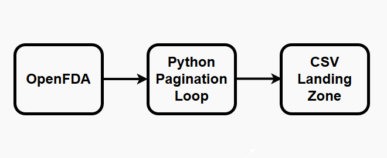
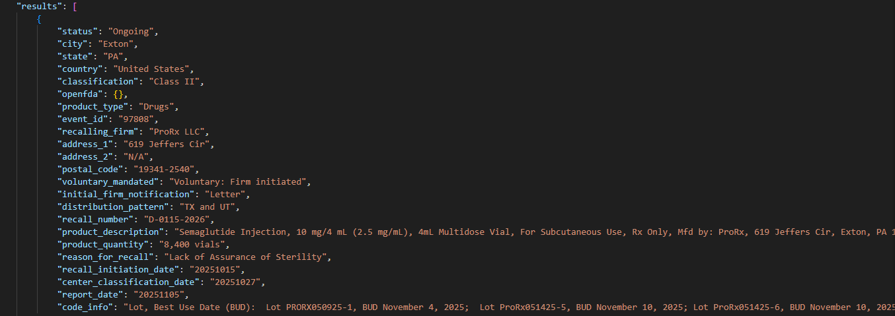

# Project 1.1: Automated API Ingestion of OpenFDA Drug Recalls

## Business Context & Problem Statement
In the pharmaceutical and healthcare industry, missing a drug recall can result in severe patient harm and massive liability. Currently, many compliance officers and pharmacy managers rely on manually checking the FDA website or reading email alerts to track enforcement reports. 

This manual process is highly error-prone, unscalable, and lacks an auditable history. To build predictive risk models or interactive compliance dashboards, the business first needs a programmatic, reliable, and automated feed of raw recall data directly from the government.

## Key Questions This Pipeline Enables
By automating the extraction of this data, we lay the data foundation to answer critical operational questions downstream:
* Which drug manufacturers are generating the most recall events?
* Are recalls trending upward or downward over the last 12 months?
* Which recall classifications (Class I, II, III) are most prevalent, and where should safety teams focus their immediate attention?
* How quickly are recalls being reported to the FDA after they are initiated by the manufacturer?

## The Analytical Approach: "Polite" ELT Extraction
I designed this pipeline following modern ELT (Extract, Load, Transform) principles. The goal of this stage is strict data acquisition, not transformation. We want to preserve the exact government text—the original "paper trail"—before applying any parsing or cleaning logic.

* **Polite API Engineering:** The OpenFDA API has strict limits. I engineered the Python extraction script to handle paginated JSON responses while actively managing rate limits (using `time.sleep()`). This "polite" extraction ensures the pipeline runs reliably in a production schedule without getting the company's IP address blacklisted.
* **Preserving the Raw JSON:** Government APIs often return deeply nested and complex JSON arrays. Rather than flattening this in flight and risking data loss, the script downloads and saves the exact, untouched JSON payloads directly to the local landing zone. 

## Strategic Business Impact
This pipeline transforms a manual, daily browser-refresh process into an automated, auditable data feed. 

By automating acquisition, a safety analyst can redirect roughly 2-4 hours per week of manual monitoring into higher-value work: actually investigating the root causes of the recalls, rather than just searching for them. 

## Technical Workflow
* **Language:** Python
* **Libraries:** `requests`, `json`, `time`
* **Source:** OpenFDA Enforcement Reports API
* **Output:** Multiple paginated `.json` files (Landed in the `data/raw/` directory)

### How to Run
1. Clone the repository and navigate to `01_data_acquisition/1_1_openfda_api/`.
2. Install dependencies: `pip install -r requirements.txt`
3. Execute the script: `python scripts/extract_fda_recalls.py`

## Next Steps in the Pipeline
Because the raw JSON from the FDA is deeply nested and notoriously unstructured, it cannot be queried by standard BI tools yet. The direct output of this project becomes the foundational input for **Project 2.1 (Python/Pandas FDA Cleaning)**, where I flatten the JSON hierarchy into a tabular format and use Regex categorization to turn the raw text into structured risk tiers.