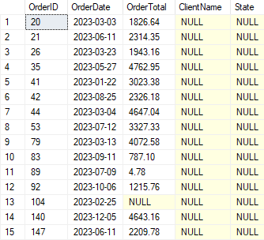
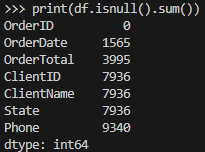
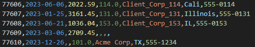

# Project 1.2: Legacy CRM Extraction & Ghost Revenue Detection

## Business Context & Problem Statement
A company is only as good as its CRM data, but legacy systems often become "black boxes" of technical debt. In this scenario, the business relied on a 15-year-old CRM database that had never been properly audited. 

The immediate technical objective was to extract the data safely for a modern data warehouse migration. However, extracting data from a live production database is like trying to change the tires on a car driving at 60mph. A heavy, poorly optimized `SELECT *` query could lock the tables and crash the live application, stopping business operations entirely.

## Key Questions This Extraction Exposes
Beyond just moving data from Point A to Point B, this extraction served as the first true data quality audit in over a decade. It was designed to answer:
* How much historical revenue is tied to "ghost" (deleted or missing) customer profiles?
* Are regional sales reports actually accurate, or is the geographic data corrupted?
* How many records contain impossible dates or null values that will break downstream financial models?

By writing a targeted extraction query, I was able to immediately isolate these anomalies directly from the database, exposing the "ghost orders" seen in the output below:

## The Extraction Strategy
* **Safe, Chunked Batching:** To protect the production server, I engineered a Python script to extract the data in chunked batches rather than a single massive payload. 
* **Security First:** I utilized a `.env` file to strictly manage database credentials, ensuring no hardcoded passwords or sensitive connection strings ever touched the version control system.
* **The LEFT JOIN Ghost Trap:** During the SQL extraction, I deliberately used `LEFT JOIN` operations between the Orders and Customers tables. This was a strategic choice to catch "orphaned" orders—transactions that exist in the system but no longer have a valid customer ID attached to them.

## The Messy Reality (Initial Findings)
Once the extraction landed, basic data profiling immediately set off alarm bells:
1. **The 16-State Anomaly:** The business only operates in 8 states, but the geographic column contained 16 distinct state variations (due to typos, trailing spaces, and legacy abbreviations).
2. **Time-Traveler Dates:** Several customer creation dates were logged in the future, or defaulted to impossible legacy system dates (e.g., 1900-01-01).
3. **Orphaned Orders:** The `LEFT JOIN` successfully trapped hundreds of records representing "ghost revenue"—money that came into the business but is no longer tied to a real person.

A programmatic audit of the raw extraction file immediately quantifies this technical debt, revealing the exact volume of missing critical fields:

## Strategic Business Impact
This extraction wasn't just a technical migration step; it was a financial revelation. 

The hundreds of orphaned orders represent real revenue that Finance is either mis-attributing or completely missing. Furthermore, the 8-to-16 state problem means regional sales reports have likely been inaccurate for years. Before this extraction, no one knew the scale of the problem. Now, the exact scope of the data debt is quantified and exposed for remediation. 

The raw extract snippet below highlights the exact inconsistencies—such as the impossible dates and fragmented state codes—that must be addressed before this data can be trusted:

## Technical Workflow
* **Languages:** Python, T-SQL
* **Database:** SQL Server
* **Libraries:** `pyodbc`, `pandas`, `python-dotenv`
* **Output:** `legacy_extract.csv` (Landed in the `data/raw/` directory)

### How to Run
1. Clone the repository and navigate to `01_data_acquisition/1_2_legacy_crm_db/`.
2. Configure your `.env` file with your local database credentials.
3. Run the SQL schema setup: `sql/1_create_legacy_db.sql`
4. Execute the extraction: `python scripts/2_extract_db.py`

## Next Steps in the Pipeline
Now that the data is safely extracted and the anomalies have been identified, the raw `legacy_extract.csv` is passed to **Project 2.2 (SQL/T-SQL CRM Cleaning)**. In that phase, I build non-destructive SQL views to standardize the geographic locations, handle the impossible dates, and properly quarantine the ghost revenue without deleting historical records.