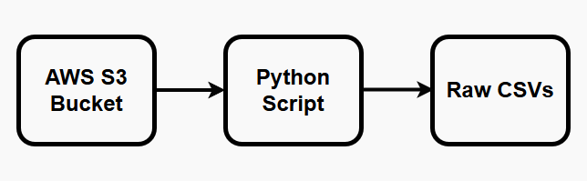
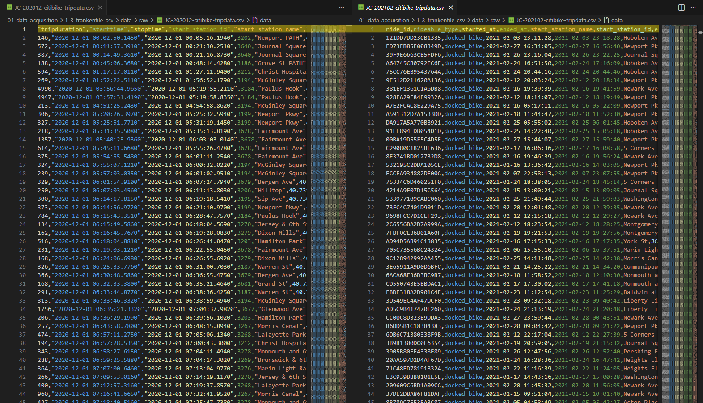
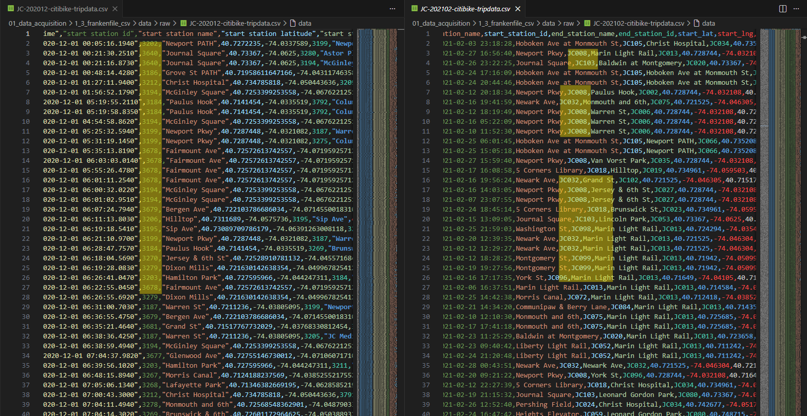

# Project 1.3: Taming the Frankenfile – Automated Citibike Schema Harmonization

## Business Context & Problem Statement
The Jersey City Citi Bike program is a public transit partnership. City planners and operations teams rely heavily on ridership data to make multi-million dollar decisions about bike rebalancing, station expansion, and seasonal staffing. 

Without consistent historical data, trend analysis breaks down and planning decisions get made on gut instinct instead of hard evidence. In early 2021, the Citi Bike backend system was completely overhauled. The result: any attempt to merge pre-2021 and post-2021 data produces broken joins, chart gaps, and misleading trend lines. I called this the "Frankenfile"—data that looks like one continuous dataset but behaves like two completely different ones stitched together.

## Key Questions This Ingestion Audit Enables
By catching these schema breaks at the ingestion layer, we preserve the integrity of the data so downstream analysts can accurately answer:
* How did ridership patterns genuinely change from December 2020 through February 2021?
* Which stations were most active before and after the schema migration?
* How do member vs. casual rider patterns differ during the winter months?

## The Analytical Approach: Automated Ingestion & Auditing
Rather than manually downloading monthly CSVs, I built a Python ingestion pipeline to automatically pull the compressed ZIP files from the public AWS S3 bucket, extract them, and land them in a local raw directory. 

The diagram below outlines the automated cloud-to-local extraction process:

## Key Findings from the Schema Audit
Once the data landed, I ran a structural audit across the December, January, and February files. I documented three critical structural breaks that must be remediated:

1. **Complete Header Drift:** Column naming changed entirely between January and February 2021 (e.g., `tripduration` became `ride_id`, `starttime` became `started_at`).
2. **The Type Clash:** Station IDs shifted from integers (e.g., `3220`) to alphanumeric strings (e.g., `JC018`)—a severe type mismatch that will break all downstream SQL `JOIN` operations.
3. **Category Shifts:** User type labels changed (`Subscriber` became `member`, `Customer` became `casual`), which would artificially break historical growth metrics if left unmapped.

The side-by-side comparison below visually highlights the exact column shifts between the December 2020 layout and the new February 2021 layout:

## Strategic Business Impact
Without this ingestion and audit step, any analyst who naively merged these files would produce a dashboard showing a false "surge" in new stations and a sudden "drop" in membership in early 2021—neither of which actually happened in reality. 

By catching and documenting these breaks before they enter the data warehouse, we ensure the final ridership dashboard gives city planners an accurate, continuous view of the 3-month winter period. The table snippet below illustrates the critical Station ID format clash that we successfully identified for remediation:

## Technical Workflow
* **Language:** Python
* **Libraries:** `requests`, `zipfile`, `io`, `os`, `pandas`
* **Source:** Citi Bike AWS S3 Public Bucket
* **Output:** Three distinct monthly `.csv` files (Landed in the `data/raw/` directory)

### How to Run
1. Clone the repository and navigate to `01_data_acquisition/1_3_frankenfile_csv/`.
2. Install dependencies: `pip install -r requirements.txt`
3. Execute the script: `python scripts/download_citibike_data.py`

## Next Steps in the Pipeline
With the raw files safely landed and the schema breaks fully documented, the data is passed to **Project 2.3 (Power Query Schema Harmonization)**. In that stage, I build a dynamic Power Query (M) script to automatically translate the legacy integer IDs into the new alphanumeric format, seamlessly stitching the "Frankenfile" back together.