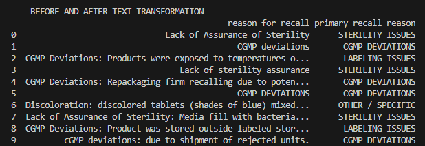
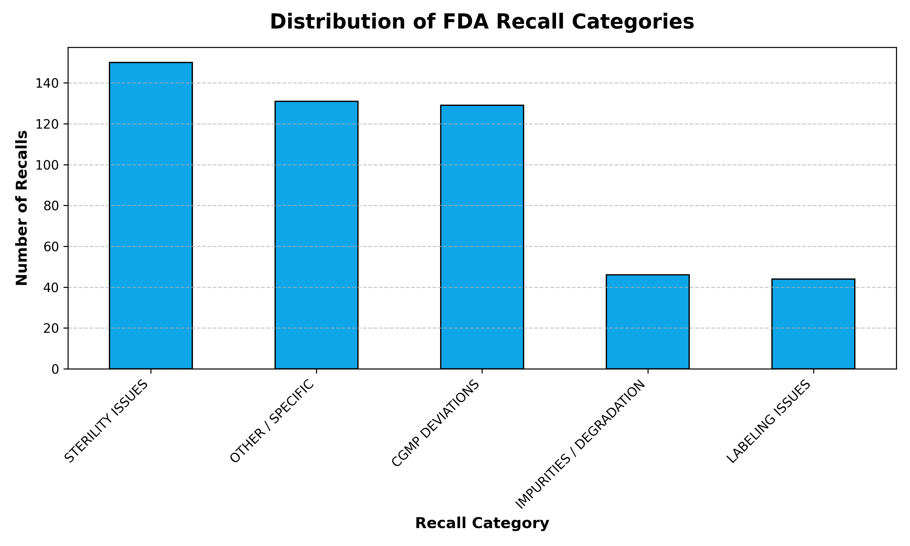
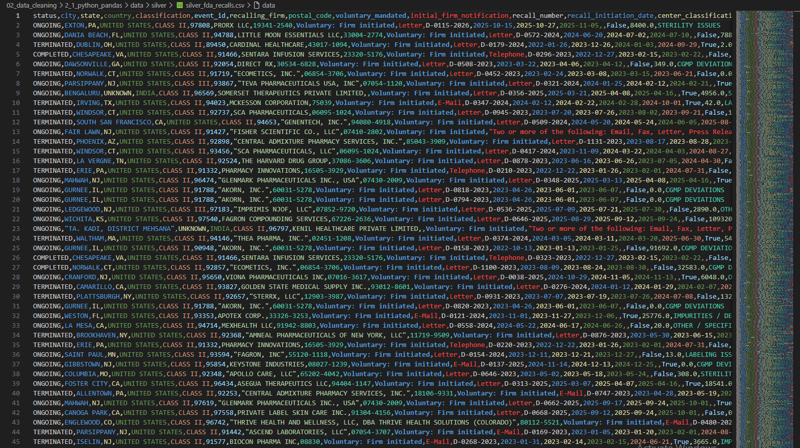
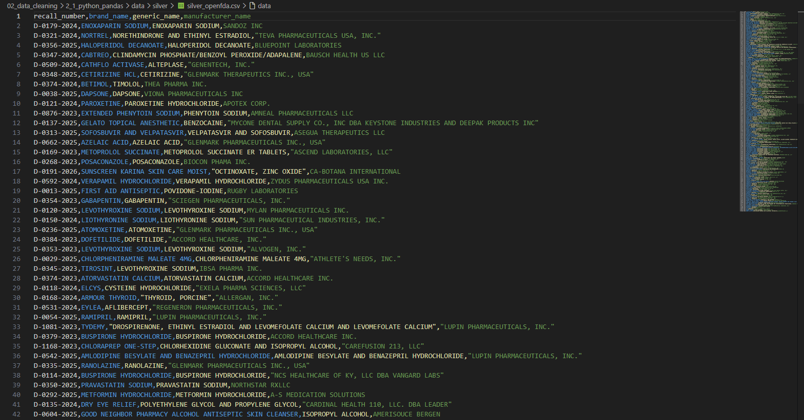

# Project 2.1: Python & Pandas – Structuring FDA Recall Text

## Business Context & Problem Statement
In Project 1.1, we successfully automated the extraction of drug recall data directly from the OpenFDA API. However, government data is notoriously unstructured. The most critical column—the "Reason for Recall"—arrives as a massive, inconsistent paragraph of legal text. 

A compliance director cannot filter, aggregate, or build risk models based on paragraphs of text. Before this data can be analyzed to identify repeat offenders or systemic manufacturing issues, the raw text must be categorized into clean, structured data points.

## Key Questions This Cleaning Phase Answers
By structuring this text, we unlock the ability to answer:
* What are the most common root causes of drug recalls (e.g., Labeling, Contamination, Sterility)?
* Are certain manufacturers systematically failing specific quality control checks?
* Which recall categories result in the highest volume of recalled units?

## The Analytical Approach: Regex Categorization & Non-Destructive Cleaning
I approached this dataset like a detective mission, using Python and Pandas to profile, clean, and categorize the text.

* **Non-Destructive Cleaning:** A core principle of data governance is never destroying the original "paper trail." Instead of overwriting the messy `reason_for_recall` column, I preserved it and engineered a new adjacent column called `recall_category`.
* **Regex Keyword Mapping:** I built a dictionary of Regular Expressions (Regex) to scan the raw text for specific compliance keywords. For example, text containing "misbranded," "undeclared," or "unreadable" was automatically mapped to the `Labeling Error` category.

The snippet below demonstrates this before-and-after transformation, showing the raw government text next to the clean analytical category:

## Key Findings from the Cleaned Data
Once the unstructured text was converted into categorical variables, immediate patterns emerged during exploratory data analysis (EDA):

1. **The 85% Rule:** Just five root cause categories account for over 85% of all recorded drug recalls in the dataset.
2. **Labeling is the Leading Flaw:** `Labeling Errors` emerged as the single largest category. This indicates that the highest frequency of errors likely occurs at the packaging vendor level, rather than deep in the chemical manufacturing process.
3. **The Sterility Paradox:** `Sterility Issues` drove a smaller count of individual recall events but were associated with the highest unit quantities affected, suggesting that when sterility fails, it compromises massive, facility-level batches.

## Strategic Business Impact
This cleaning step transforms 1,000+ unreadable text blobs into a structured, filterable database. 

A compliance director can now answer questions in seconds—such as "Show me all Labeling Errors in 2023"—that previously required manually reading hundreds of FDA notices. By enforcing data structure at this layer, we guarantee that the final executive dashboards are accurate, aggregatable, and immediately actionable.

## Technical Workflow
* **Language:** Python
* **Libraries:** `pandas`, `numpy`, `re` (Regular Expressions)
* **Input:** `fda_recalls_raw.csv` (From Stage 1)
* **Output:** `silver_fda_recalls.csv` (Landed in the `data/silver/` directory)

### How to Run
1. Clone the repository and navigate to `02_data_cleaning/2_1_python_pandas/`.
2. Install dependencies: `pip install -r requirements.txt`
3. Run the EDA script to see the raw data profile: `python scripts/1_eda_fda_data.py`
4. Run the cleaning script to generate the structured CSV: `python scripts/2_clean_fda_data.py`

## Next Steps in the Pipeline
With the data now cleaned and categorized (our "Silver" layer), it is ready for advanced mathematical modeling. The `silver_fda_recalls.csv` file is handed off to **Project 3.1 (Python Feature Engineering)**, where I calculate compliance response times and build a weighted Risk Score for every manufacturer.