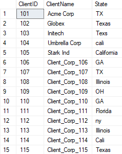
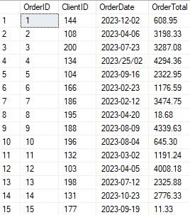
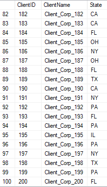
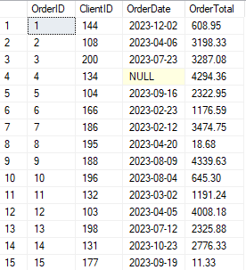

# Project 2.2: SQL/T-SQL CRM Cleaning & Data Standardization

## Business Context & Problem Statement
In Project 1.2, we successfully extracted 15 years of legacy CRM data. However, the extraction exposed severe data debt: orphaned "ghost" orders, 16 distinct state variations for an 8-state sales territory, and impossible "time-traveler" dates. 

If this raw data is fed directly into a Business Intelligence tool, the resulting dashboards will display inflated revenue, broken regional maps, and misleading year-over-year trends. The business requires a cleaned, standardized "Silver" layer of data that acts as the single source of truth for all downstream reporting.

## Key Questions This Cleaning Phase Answers
This transformation stage was designed to resolve critical business data questions:
* How do we correct legacy data errors without permanently deleting historical financial records?
* How do we standardize geographic inputs so regional sales managers can trust their territory reports?
* How do we quarantine "ghost revenue" so financial models only reflect verified customers?

## The Analytical Approach: Non-Destructive Views & Data Firewalls
Rather than running irreversible `UPDATE` or `DELETE` statements on the raw tables, I employed a modern data engineering approach: **Non-Destructive Views**. 

I built a SQL View that sits on top of the raw data, applying cleaning logic on the fly. If business rules change later, we simply update the View logic without having destroyed the underlying historical data. 

To build this robust Silver layer, I implemented several key SQL techniques:
* **The `TRY_CAST` Firewall:** Legacy systems often allow text in numeric fields. I used `TRY_CAST` to safely convert data types. If an impossible value (like text in a date column) tries to pass through, the firewall catches it and converts it to a safe `NULL` rather than crashing the entire pipeline.
* **Standardization via `CASE`:** I wrote comprehensive `CASE` statements to harmonize the scattered text entries (e.g., mapping "Tex", "TX ", and "Texas" into a clean "TX").

## Key Fixes & Structural Improvements
By running the cleaning script, the data was fundamentally transformed:
1. **Exorcising Ghost Revenue:** By explicitly filtering out the orphaned `OrderID` records discovered in Stage 1, we prevented unverified revenue from polluting the financial models.
2. **The 16-to-8 State Consolidation:** The 16 fragmented state entries were successfully mapped and consolidated down to the correct 8 operational sales territories. 
3. **Validating Contact Data:** Phone numbers were standardized to 10 digits, and impossible legacy system dates (e.g., `1900-01-01`) were quarantined.

The side-by-side comparison below highlights how the scattered, raw inputs were standardized into a clean, queryable format:

## Strategic Business Impact
After applying these specific cleaning transformations, the Legacy CRM database transitions from a liability into a highly valuable asset. 

Sales leadership can now run accurate, trusted regional revenue reports for their exact 8 territories. Finance can finally tie every dollar of historical revenue to a verified, active customer record. The sales team can call their contact list knowing every phone number in the system has been validated. 

This clean, reliable data structure is now ready for presentation.

## Technical Workflow
* **Language:** T-SQL
* **Database:** SQL Server
* **Key Functions:** `CREATE VIEW`, `TRY_CAST`, `CASE WHEN`, `COALESCE`, `LEFT JOIN`, `IS NOT NULL`

### How to Run
1. Navigate to `02_data_cleaning/2_2_sql_tsql/scripts/`.
2. Execute `01_profile_crm_data.sql` in your SQL Server environment to view the initial data quality anomalies.
3. Execute `02_clean_silver_crm_view.sql` to generate the non-destructive Silver views.

## Next Steps in the Pipeline
This clean Silver layer is the direct, structural foundation for the advanced modeling built in **Project 3.2 (SQL RFM Customer Segmentation)**. Because the data is now trustworthy, we can mathematically segment the customer base into Recency, Frequency, and Monetary tiers without worrying about ghost orders skewing the calculations.