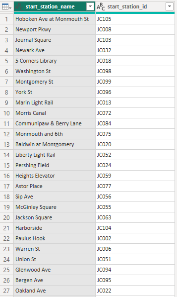
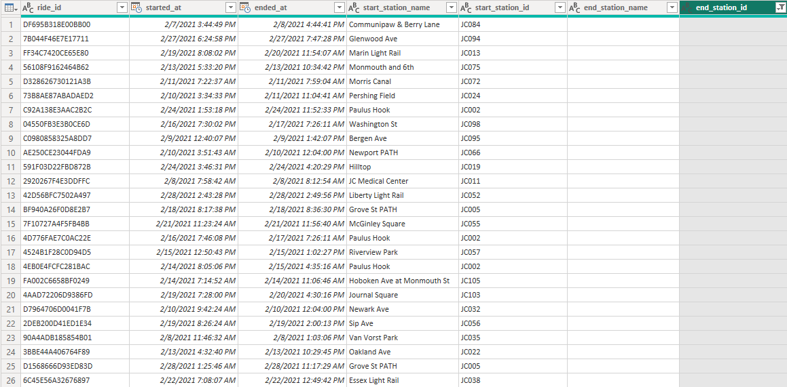
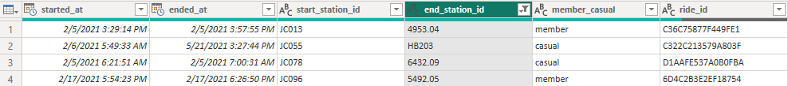

# Project 2.3: Power Query Schema Harmonization & Commuter Analysis

## Business Context & Problem Statement
City transit planners make critical decisions about station expansion, maintenance scheduling, and rebalancing crew deployment based on ridership data. 

In Project 1.3, we intercepted the "Frankenfile"—a historical Citi Bike dataset broken by a massive backend system migration in early 2021. The most severe issue was that Station IDs shifted from legacy integers (e.g., `3220`) to alphanumeric strings (e.g., `JC018`). A broken historical dataset, where the same station appears under two completely different IDs across different time periods, completely undermines seasonal trend analysis. 

This project ensures that "5 Corners Library" is counted as one continuous station, not two, so that ridership patterns from December 2020 through February 2021 can be analyzed as a single, unified narrative.

## Key Questions This Harmonization Answers
By stitching this fractured data back together, we enable transit planners to accurately answer:
* Which routes (start station to end station) were most popular across the entire winter transition?
* What proportion of Jersey City Citi Bike trips actually cross state lines into Manhattan or Hoboken?
* How did average trip duration change month-over-month despite the system migration?
* What is the true ratio of "member" vs. "casual" riders, and how consistent is it across the winter?

## The Analytical Approach: Double-Merge Translation
To fix the system break without losing data, I utilized Power Query (M) inside Power BI to build an automated harmonization pipeline. 

Rather than manually renaming hundreds of stations, I engineered a "Double-Merge" approach. I built a master translation dictionary that mapped every legacy integer ID to its new alphanumeric counterpart. By merging the broken historical records against this master key, I successfully translated the legacy rows into the modern schema. 

The image below demonstrates the successful mapping of the legacy IDs into the unified format:

## Key Discovery: The Manhattan Anomaly & Ghost Bikes
During the data profiling and cleaning phase, I uncovered two significant anomalies that required deep domain knowledge to resolve:

1. **The Manhattan Anomaly:** During ID harmonization, I found several station IDs using decimal-format NYC grid coordinates (e.g., `5492.05` for Cleveland Pl & Spring St) rather than standard Jersey City codes. Initially, these appeared to be data entry errors. However, by cross-referencing the station names, I proved these were legitimate trips where riders took bikes onto the PATH train or ferry into Manhattan. Rather than deleting these "inconsistent" records, I preserved and flagged them as a valuable cross-city commuter segment.
2. **Ghost Bikes:** A subset of trips contained start times and start stations, but `NULL` end times and end stations. I identified these as "Ghost Bikes"—bikes that were checked out but either stolen, lost, or broken mid-trip before being docked. 

## Strategic Business Impact
If we had simply dropped the anomalies or failed to map the legacy IDs, the city planners would have made decisions based on false intelligence. They would have seen a false "surge" of new stations in 2021, and they would be completely blind to the cross-Hudson commuter behavior.

By actively preserving the Manhattan Anomaly, we proved that there is a distinct user persona—commuters, not just local recreational riders—which has major implications for how the city should position cross-city transit partnerships.

## Technical Workflow
* **Tool:** Power BI (Power Query Editor)
* **Language:** M (Power Query Formula Language)
* **Techniques:** Conditional Columns, Double-Merge Joins, Custom Error Handling
* **Input:** Raw Citi Bike CSVs (Dec 2020 - Feb 2021)
* **Output:** Cleaned Data Model ready for Star Schema Design

### How to Run
1. Navigate to `02_data_cleaning/2_3_power_query/scripts/`.
2. Open `Power Query Cleaning.pbix` in Power BI Desktop.
3. Open the **Transform Data** window to view the applied M-script steps and the translation dictionary logic.

## Next Steps in the Pipeline
The data is now clean, standardized, and harmonized. However, loading 500,000+ rows of flat data directly into a Power BI dashboard will result in massive performance lag. In **Project 3.4 (Power BI Star Schema)**, I transform this clean, flat dataset into a high-performance dimensional model, separating the heavy descriptive station text from the lightweight transaction numbers.