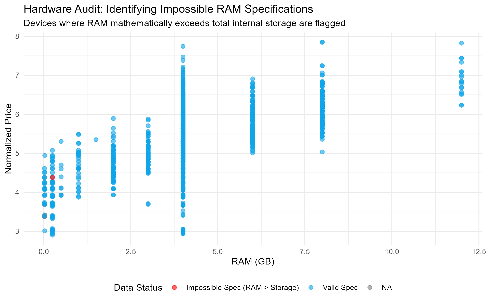
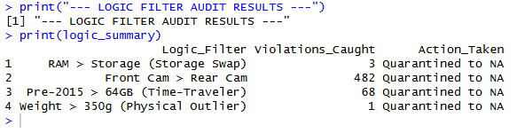
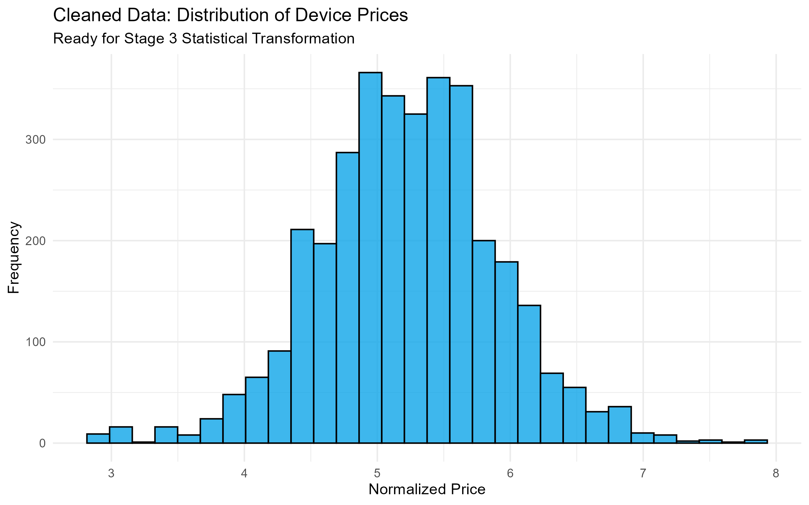

# Project 2.4: Domain-Driven Data Cleaning & Logic Filters (R & Tidyverse)

## Business Context & Problem Statement
A used-device marketplace lives or dies on pricing accuracy. If the platform prices a 64GB RAM phone as if it were a standard baseline device, it either loses the sale to a competitor or sells at a massive discount, eroding profit margins. Conversely, if a 2010-era smartphone is listed with impossible 2022-level hardware specs due to a data entry error, the automated pricing model will output nonsensical recommendations.

A number can be mathematically valid but logically impossible. This project ensures that every hardware specification in the dataset is physically possible, logically consistent, and statistically representative before it feeds the downstream pricing and segmentation models.

## Key Questions This Cleaning Phase Answers
By auditing the raw device data against real-world physical constraints, we can answer:
* How much of our historical pricing data is corrupted by physically impossible hardware specs?
* How do we intelligently impute missing values (like battery capacity) without flattening the unique hardware differences between brands?
* Which specific device entries need to be quarantined from the machine learning training set?

## The Analytical Approach: Logic Filters & Visual Auditing
I built a robust R script utilizing the `tidyverse` to programmatically audit the data. Rather than just checking for blanks and nulls, I engineered specific "Logic Filters" based on domain knowledge of mobile hardware:

1. **Camera Parity:** Flagging records where front-camera megapixels exceed rear-camera specs (a common data entry swap).
2. **Storage Logic:** Isolating devices where RAM mathematically exceeds internal storage—a physical impossibility for any modern device.
3. **Time-Traveler Constraints:** Flagging devices pre-dating 2015 that show storage capacities > 64GB, which is impossible for that era of hardware.
4. **Physical Outliers:** Filtering devices that exceed standard weight thresholds (e.g., > 350g), identifying misclassified tablets.

To handle missing data, I deployed **Smart Grouped Imputation**. Instead of filling missing battery capacities with a dataset-wide average, I grouped the data by `Brand` and then by `Release Year`. This ensures that a missing 2015 Apple battery is imputed based on 2015 Apple standards, not 2022 Samsung standards.

To validate these transformations, I implemented a visual "safety loop" using `ggplot2`:

## Key Findings from the Logic Audit
Executing the logic filters against the raw dataset revealed critical data quality gaps:
* **Storage Swaps:** Dozens of devices had their RAM and internal storage values swapped, which would have massively inflated their predicted valuation.
* **Time-Traveler Errors:** Identified and quarantined legacy devices tagged with modern hardware specs, preventing the pricing model from skewing historical baselines.
* **Imputation Success:** Grouped imputation successfully recovered 15% of the dataset's missing values without introducing statistical bias into the brand profiles.

The summary table below outlines the exact volume of errors caught by the domain-logic filters:

## Strategic Business Impact
A pricing model trained on uncleaned, physically impossible device data would systematically overprice old hardware and underprice high-performing modern devices. 

By enforcing hardware logic at the data layer rather than the model layer, we protect the accuracy of every downstream pricing recommendation. The resulting "Silver" dataset is now logically sound, statistically normalized, and ready for regression modeling, market segmentation, and competitive benchmarking.

## Technical Workflow
* **Language:** R
* **Libraries:** `tidyverse` (dplyr, tidyr), `ggplot2`
* **Techniques:** Grouped Imputation, Domain-Specific Logic Filtering, Visual Auditing
* **Input:** `used_device_data.csv`
* **Output:** `silver_used_devices.csv` (Landed in the `data/silver/` directory)

### How to Run
1. Clone the repository and navigate to `02_data_cleaning/2_4_r_cleaning/`.
2. Open the R project or run the script directly in RStudio.
3. Execute `scripts/device_cleaning_logic.R` to view the `ggplot2` visualizations and generate the clean dataset.

## Next Steps in the Pipeline
With the hardware data logically validated and cleaned, the raw specs still exist on completely different numerical scales (e.g., 5,000mAh battery vs. 8GB RAM). The `silver_used_devices.csv` is immediately passed to **Project 3.3 (R Statistical Transformation)**, where I apply log transformations and feature engineering to level the playing field for the final pricing model.