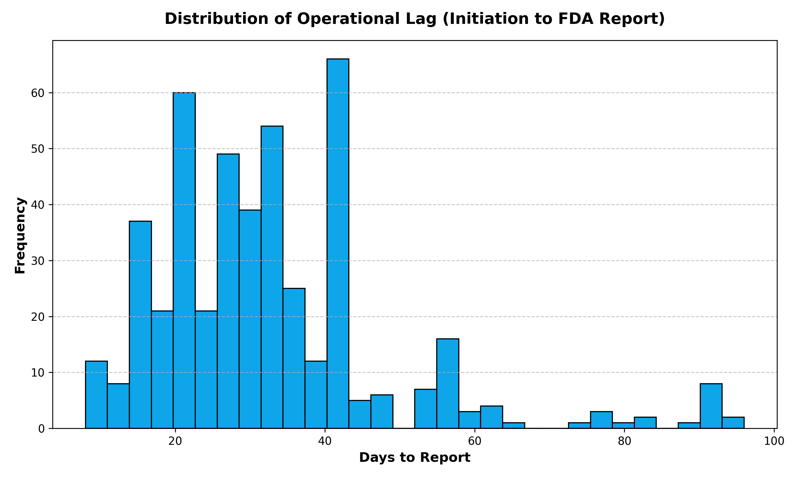
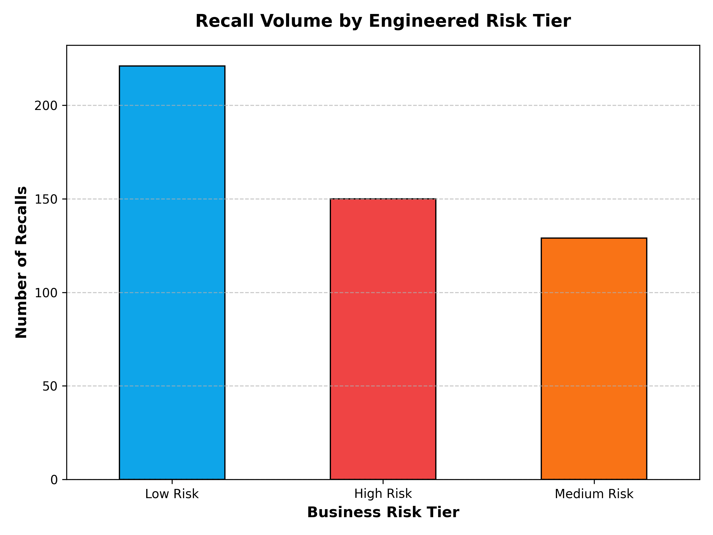

# Project 3.1: Python Feature Engineering – Structuring a Drug Safety Risk Matrix

## Business Context & Problem Statement
In Stage 2, we converted messy FDA text into clean, standardized categories. However, raw categories alone do not tell a compliance director which manufacturer poses the highest immediate risk to public safety. 

A "Labeling Error" from a manufacturer that reports recalls to the FDA in 2 days represents a vastly different operational risk profile than a manufacturer reporting a "Sterility Issue" that takes 45 days to document. To prioritize safety audits and vendor inspections, the business needs a quantitative Risk Matrix. This project transforms the cleaned "Silver" data into a "Gold" analytical dataset by engineering behavioral features that capture true compliance performance.

## Key Questions This Transformation Answers
By engineering new data points from the existing timestamps and categories, we can answer:
* How long is the average "Operational Lag" (time between a recall's initiation and the official FDA notification) for the industry?
* What proportion of our supply chain issues fall into critical "High Risk" categories (e.g., Contamination) versus "Low Risk" administrative errors?
* How can we prepare this data so the BI team can instantly generate smooth month-over-month trend analysis?

## The Analytical Approach: Feature Engineering for Risk
I utilized Python, Pandas, and NumPy to engineer three primary operational features, constructing the final analytical matrix:

1. **Operational Lag (Duration in Days):** I engineered a new continuous variable calculating the number of days between the `recall_initiation_date` and the `report_date`. This serves as a direct proxy for manufacturer transparency and operational speed.
2. **Business Risk Tiers via `np.select`:** Not all recalls are equal. I built domain-specific arrays mapping severe issues (`STERILITY ISSUES`, `PATHOGEN`, `CONTAMINATION`) to "High Risk", manufacturing deviations to "Medium Risk", and defaulting administrative errors to "Low Risk". This array-mapping logic categorizes the data exactly how executives want to read it.
3. **Time-Series Extraction:** To prevent downstream Business Intelligence tools from struggling with complex date logic, I pre-extracted `recall_month_year` and `recall_quarter` directly into the Gold dataset.

## Key Findings & Risk Insights
By visualizing these engineered features, critical safety insights immediately emerged from the dataset:

* **The Long Tail of Operational Lag:** While the median lag for the industry is relatively short, there is a severe "High Risk" tail. Dozens of recall events show a lag of over 30 days, indicating potential deliberate reporting delays or severe internal friction at certain manufacturing firms.

* **Risk Stratification:** The newly engineered Risk Tiers reveal that while "Low Risk" labeling errors dominate the overall volume, a significant and concerning percentage of recalls trigger the "High Risk" threshold, requiring immediate regulatory quarantine protocols.

## Strategic Business Impact
This feature engineering step fundamentally moves the organization from reactive data-gathering to proactive risk management. 

A compliance director or supply-chain manager can now filter the entire drug manufacturing network by a single "High Risk" flag rather than manually reading individual FDA reports. Furthermore, by pre-calculating the time-series features and operational lag, the data is perfectly optimized to be loaded directly into a dashboard, drastically reducing the DAX/SQL load on the BI engine.

## Technical Workflow
* **Language:** Python
* **Libraries:** `pandas`, `numpy`, `datetime`, `os`
* **Input:** `silver_fda_recalls.csv` (From Stage 2)
* **Output:** `gold_fda_analytical_matrix.csv` (Landed in the `data/` directory)

### How to Run
1. Clone the repository and navigate to `03_data_transformation/3_1_python_pandas/`.
2. Install dependencies: `pip install -r requirements.txt`
3. Execute the engineering script: `python scripts/3_engineer_fda_features.py`

## Next Steps in the Pipeline
This completes the FDA Drug Safety Series. The resulting `gold_fda_analytical_matrix.csv` is a clean, structured, and feature-rich dataset that is now fully optimized to be loaded directly into a Business Intelligence tool (like Power BI or Tableau) for executive dashboarding.