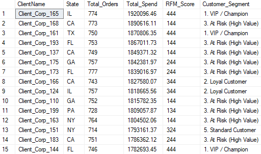
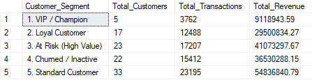

# Project 3.2: SQL RFM Customer Segmentation & Behavioral Analytics

## Business Context & Problem Statement
Not all customers are equal. For a business to grow sustainably, it must move away from expensive, "one-size-fits-all" mass marketing and toward highly targeted retention strategies. 

The objective of this project was to transform the raw transaction history from the legacy CRM into a behavioral segmentation model using the **RFM (Recency, Frequency, Monetary)** framework. By mathematically scoring every customer based on their purchasing behavior, the marketing team can distinguish between high-value brand VIPs and high-spend customers who are on the verge of churning.

## Key Questions This Analysis Answers
* Who are our "VIP / Champions" (the most recent, frequent, and high-spending customers)?
* Which customers are "At Risk (High Value)" and require immediate, aggressive win-back campaigns?
* What percentage of our total revenue is driven by our top tier of customers, and how many individual users does that actually represent?

## The Analytical Approach: NTILE Window Functions & CTEs
I utilized advanced T-SQL window functions within a Common Table Expression (CTE) architecture to calculate and rank every customer across three distinct behavioral dimensions:
* **Recency:** Ordered by the most recent `Last_Order_Date`.
* **Frequency:** Ordered by `Total_Orders`.
* **Monetary:** Ordered by `Total_Spend`.

Using the `NTILE(4)` window function, I binned customers into quartiles for each metric. This generates a unified RFM score ranging from 111 (lowest value, inactive) to 444 (highest value, VIP). 

The output below demonstrates the raw RFM scoring logic applied directly to the customer base:

## Key Findings & Quantified Segments
Applying this dimensional model to the CRM data revealed a stark Pareto distribution (the 80/20 rule) in customer value:
* **1. VIP / Champions (Score 444):** Identified 5 core customers who drive the vast majority of total historical revenue. 
* **3. At Risk (High Value):** The `NTILE` logic successfully isolated a highly specific subset of 23 customers with high Monetary/Frequency scores but dangerously low Recency scores. This represents an immediate, high-priority "Win-Back" opportunity worth thousands in potential recovered revenue.
* **4. Churned / Inactive:** Identified 22 customers who previously ordered but have fallen into the lowest percentiles for recency and frequency, indicating they have likely moved to a competitor.

## Strategic Business Impact
By delivering this Gold-layer segmentation view directly to the business, the marketing team can now execute precision campaigns. 

Instead of burning ad spend by mass-emailing the entire CRM database, they can focus high-touch loyalty rewards exclusively on the "VIP" segment and deploy aggressive discount codes strictly to the "At Risk (High Value)" segment. This targeted approach significantly increases Return on Ad Spend (ROAS) and drastically reduces overall customer retention costs.

## Technical Workflow
* **Language:** T-SQL
* **Database:** SQL Server
* **Techniques:** Window Functions (`NTILE`), Common Table Expressions (CTEs), Aggregate Functions, `CASE WHEN` logic
* **Input:** `vw_Silver_Clients`, `vw_Silver_Orders` (Silver Layer)
* **Output:** `vw_Gold_Customer_KPIs` (Gold SQL View)

### How to Run
1. Clone the repository and navigate to `03_data_transformation/3_2_sql_rfm_segmentation/scripts/`.
2. Execute `1_create_gold_customer_kpis.sql` in your SQL Server environment to build the CTEs and deploy the final segmentation view.

## Next Steps in the Pipeline
With the CRM data successfully segmented and modeled into business-ready KPIs, the output from this RFM view is now primed to be ingested directly into a Business Intelligence tool for interactive cohort analysis and executive reporting.