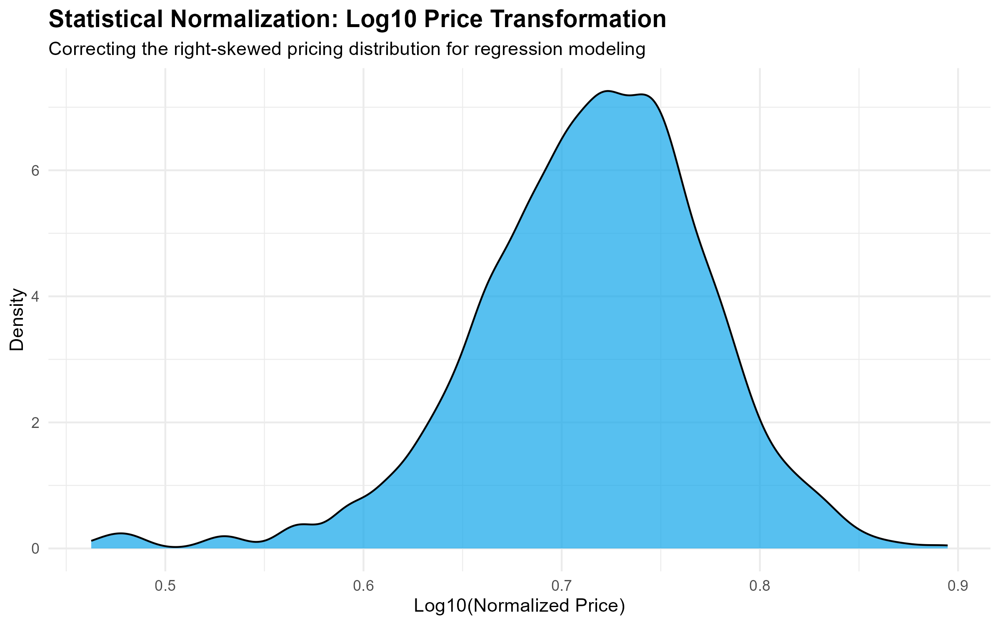
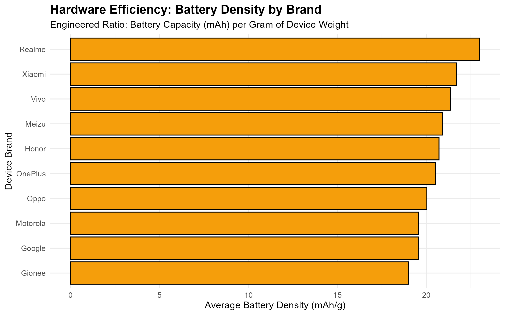

# Project 3.3: R Statistical Transformation – Engineering "Value for Money"

## Business Context & Problem Statement
In a used-device marketplace, raw hardware specifications do not tell the whole story. A 5,000mAh battery and 8GB of RAM exist on completely different numerical scales, and a flagship device from 2015 cannot be compared directly to a mid-tier device from 2022 without mathematical context. 

If the marketplace's pricing algorithm relies purely on raw numbers, it will systematically overprice outdated luxury phones and underprice highly efficient modern budget phones. To help consumers find the best deals and protect platform margins, we must "level the playing field." This project applies statistical scaling and efficiency-ratio engineering to ensure every device can be evaluated on its actual performance-to-price value, regardless of its era or brand.

## Key Questions This Analysis Answers
* Which smartphone brands consistently deliver the highest hardware efficiency (e.g., battery capacity per gram of weight)?
* How do we compare prices across different release years without the model being skewed by a few ultra-premium, outlier devices?
* How can we mathematically scale completely different hardware attributes (RAM vs. Weight) so they can be fed into a single predictive machine learning model?

## The Analytical Approach: Scaling & Ratio Engineering
I utilized R and the `tidyverse` to perform three critical statistical transformations on the Silver dataset:

1. **Logarithmic Transformation:** Used-device prices are heavily right-skewed by a few ultra-premium models (e.g., 1TB foldable phones). I applied a `log10` transformation to the target price column to normalize the distribution, transforming it into a bell curve that is perfectly optimized for linear regression modeling.
2. **Z-Score Normalization:** I converted the raw hardware specs (RAM, Storage, Battery) into Z-scores (standard deviations from the mean). This standardizes the variance, allowing us to compare "apples to oranges"—mathematically comparing a device's RAM percentile directly against its battery percentile.
3. **Efficiency Ratios:** I engineered new continuous variables, such as "Battery Density" (mAh per gram), to identify the most physically efficient hardware designs on the market.

## Key Findings & Efficiency Insights
By shifting the focus from raw numbers to statistical relationships, several hidden market dynamics emerged:
* **The Log-Normal Pricing Curve:** The `log10` transformation successfully pulled in the extreme luxury outliers, proving that the vast majority of the secondary market behaves highly predictably once the skew is removed.
* **Battery Efficiency Leaders:** The engineered Battery Density ratio revealed that certain mid-tier brands drastically outperform premium flagship brands in pure physical efficiency (delivering more battery life for less physical weight). This provides a massive marketing angle for promoting "Best Value" devices to practical consumers.

## Strategic Business Impact
By delivering a statistically normalized "Gold" dataset, we enable the downstream pricing engine to make fair, accurate, and scalable recommendations. 

The business can now automatically flag "Overpriced" vs. "Best Value" devices for customers based on their normalized hardware efficiency scores. This data structure directly drives trust in the platform's pricing authority and increases conversion rates for high-value-for-money inventory.

## Technical Workflow
* **Language:** R
* **Libraries:** `dplyr`, `ggplot2`, `tidyr`, `scales`
* **Techniques:** Log10 Transformations, Z-Score Scaling (Standardization), Feature Ratio Engineering
* **Input:** `silver_used_devices.csv` (From Stage 2)
* **Output:** `gold_engineered_devices.csv`

### How to Run
1. Clone the repository and navigate to `03_data_transformation/3_3_r_statistical_transformation/`.
2. Open the R project or execute the script directly: `Rscript scripts/1_statistical_engineering.R`

## Next Steps in the Pipeline
With the device data completely cleaned, imputed, and statistically normalized, the Data Engineering and Transformation phases are complete. The `gold_engineered_devices.csv` is now ready to be pushed to the presentation layer or fed directly into a predictive pricing algorithm.