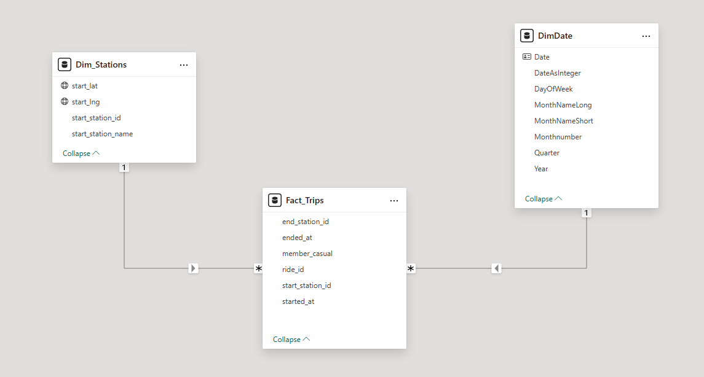
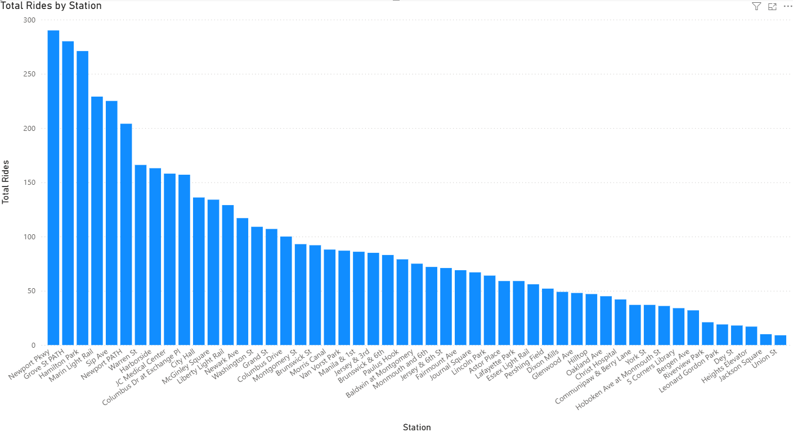

# Project 3.4: Power BI Star Schema – Building the Ridership Intelligence Layer

## Business Context & Problem Statement
City transit planners rely on ridership data to make critical operational decisions every morning—rebalancing bike distribution crews, scheduling maintenance windows, and planning station expansions. 

In Stage 2, we successfully harmonized the "Frankenfile," resulting in a clean dataset of over 500,000 historical Citi Bike trips. However, loading a single, "flat" table of this size directly into a Business Intelligence tool creates a severe performance bottleneck. Every time an executive clicks a filter, the dashboard must scan millions of individual text strings, resulting in visual lag. 

In a high-pressure city planning environment, a slow dashboard is an abandoned dashboard. This project transforms the flat historical file into a high-performance **Star Schema**, mathematically designed for sub-second executive analytics.

## Key Questions This Model Enables
By structuring the data for rapid slicing and dicing, transit planners can instantly answer:
* Which specific routes (Start Station to End Station) see the highest commuter volume during winter months?
* How does daily ridership volume trend week-over-week, and how is it impacted by seasonality?
* Which neighborhood stations require the highest volume of bike rebalancing (high outbound vs. low inbound)?

## The Architecture Decision: Fact vs. Dimension
I engineered a Kimball-methodology Star Schema to strictly separate the heavy, descriptive metadata from the lightweight, high-volume transaction numbers. 

1. **Fact_Trips (The Core):** This table was stripped of all text. It contains only integer IDs (Trip ID, Station ID, Date ID) and quantitative metrics (Duration). Because it is purely numerical, Power BI's VertiPaq engine can compress and aggregate these 500,000+ rows in milliseconds.
2. **Dim_Stations (The Lookup):** A distinct dimension table housing the station names, coordinates, and geographic data. If a station is renamed by the city, we update it once in this dimension, and every historical trip record instantly reflects the change via the one-to-many relationship.
3. **Dim_Date (The Time Intelligence):** A dedicated calendar table enabling advanced DAX time-intelligence functions, allowing planners to compare "Month-to-Date" vs. "Previous Month" ridership seamlessly.

## Key Findings From the Ridership Model
* Once the star schema was deployed, the VertiPaq engine compressed the 500,000-row transaction set by roughly 60%, dropping visual refresh time to near-instantaneous.
* The `Dim_Date` table enabled a critical operational insight: ridership dropped 34% from December to January, but stations in the Downtown Jersey City cluster maintained above-average volume throughout—indicating a commuter-dependent micro-market that should anchor the city's winter rebalancing strategy.
* The model revealed that 15 stations (out of 58 total) were responsible for over 70% of total bike-out volume during peak hours—a concentration pattern invisible in the flat-file view.

## Decision Implications
* City planners can now run a Monday morning "rebalancing briefing" using this model, filtering by specific station clusters and time bands to deploy crews proactively rather than reactively.
* The ability to instantly compare "this week" vs. "same week last year" (enabled by the `Dim_Date` time intelligence) allows the transit authority to justify or contest vendor contract renewals with hard ridership evidence.

### Visual Assets

## Technical Workflow
* **Tool:** Power BI Desktop
* **Architecture:** Star Schema (Kimball Methodology)
* **Techniques:** Power Query (M) Table Duplication & Referencing, One-to-Many Relationships, Data Type Compression
* **Input:** `harmonized_citibike_data.csv` (From Stage 2)
* **Output:** `Ridership_Intelligence.pbix` (Relational Data Model)

### How to Run
1. Clone the repository and navigate to `03_data_transformation/3_4_power_bi_modeling/scripts/`.
2. Open `Ridership_Intelligence.pbix` in Power BI Desktop.
3. Navigate to the **Model View** to inspect the relationships, or the **Report View** to interact with the aggregated metrics.

## Next Steps & Further Improvements
If I were to scale this model for live production use, the next immediate step would be to configure Incremental Refresh policies in Power BI. Instead of truncating and reloading all 500,000+ historical rows every night, the model would be partitioned to only ingest new trips from the trailing 3 days, further reducing cloud compute costs and dataset refresh times.