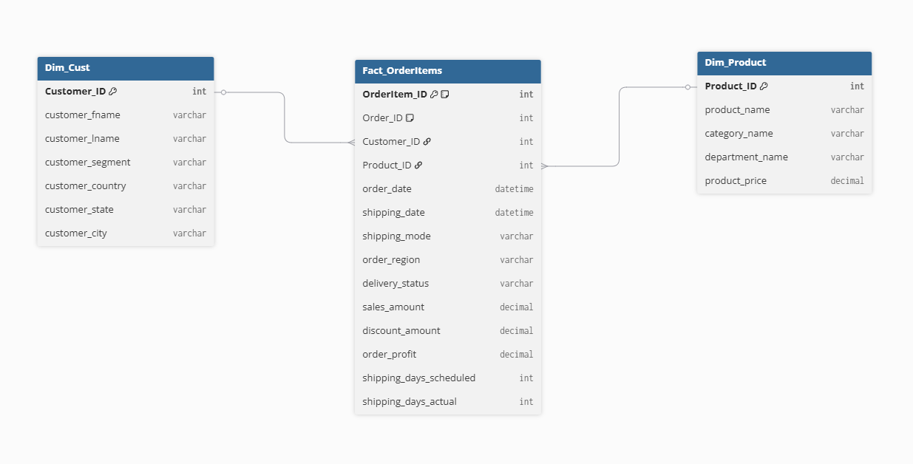
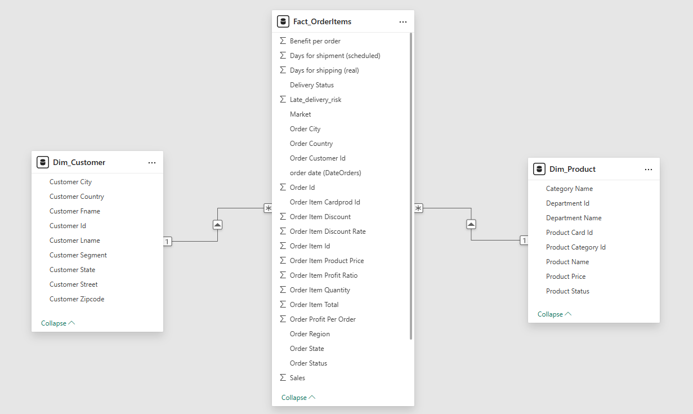
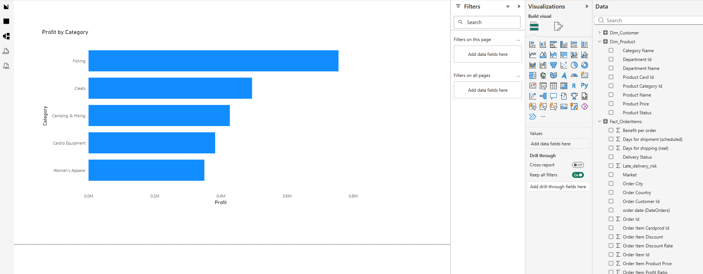

# Project 4.1: Power BI Supply Chain Modeling – Architecting for Operations

## Business Context & Problem Statement
A global supply chain operation generates data at every single step: when a customer places an order, when a product ships, when it arrives, and whether the business actually turned a profit on that transaction. 

However, raw supply chain data is dangerous. It frequently mixes customer demographics, product specifications, and financial metrics all into one massive, flat table. This "mixed granularity" makes it nearly impossible for operations managers to ask focused questions about delivery performance or profitability without writing slow, fragile queries that lag the system.

This project transforms the complex DataCo Smart Supply Chain dataset (comprising over 180,000 transactions and 52 raw columns) into a high-performance Star Schema. This architecture allows the logistics team to drill down from executive-level profit summaries to individual order delays in milliseconds.

## Key Questions This Model Enables
By structuring the data dimensionally, the business can now instantly answer:
* Which product categories generate the highest profit margins, and which are active financial liabilities?
* What is the average shipping delay by geographic region, and which markets consistently underperform SLA targets?
* How does the late delivery rate vary depending on the shipping mode (e.g., First Class vs. Standard Class)?
* Which specific customer segments drive the highest repeat order rates?

## The Analytical Approach: Star Schema over Snowflake
To build this model, I had to make critical architectural decisions regarding normalization. I actively chose to build a **Star Schema** rather than a highly normalized Snowflake Schema. 

While a Snowflake Schema would have saved minor storage space by breaking the product data into multiple sub-dimensions (e.g., separating Category from Product), it would have forced Power BI's VertiPaq engine to perform expensive, multi-hop joins on every query. By denormalizing the product dimension into a single `Dim_Product` table, I optimized the model strictly for read-performance, ensuring the dashboard remains lightning-fast for end users.

Additionally, I improved data security and model size by actively dropping masked or "zero-value" columns (such as Customer Email and Password hashes) that offer no analytical value to the operations team.

## The Three-Table Architecture
1. **Fact_OrderItems (The Core):** Contains the quantitative metrics (sales, discount amounts, profit) and foreign keys. This table is strictly numeric, allowing for massive compression.
2. **Dim_Cust (The Who):** Contains all descriptive customer attributes, isolated from the transaction flow.
3. **Dim_Product (The What):** A denormalized dimension containing product names, categories, and departmental hierarchies.

## Key Findings & Operational Insights
Once the Star Schema was deployed, analyzing the 180,000-row dataset revealed immediate operational bottlenecks:
* **The Profitability Skew:** A concentrated subset of product categories drives the vast majority of the company's net profit, while several high-volume categories actually operate at a net loss once shipping delays and discounts are factored in.
* **SLA Failures:** The data revealed distinct geographic regions where Standard Class shipping consistently fails to meet delivery SLAs, driving up customer churn risk.

## Strategic Business Impact
By transitioning from a flat file to a dimensional model, the supply chain team is no longer flying blind. 

Logistics managers can now reliably track shipping delays by mode and region, allowing them to renegotiate failing vendor contracts. Furthermore, the finance team can isolate exactly which product categories are draining margins, driving immediate, data-backed inventory purchasing decisions.

## Technical Workflow
* **Tool:** Power BI Desktop / Power Query
* **Language:** M (Power Query Formula Language), DAX
* **Architecture:** Star Schema (Kimball Methodology)
* **Input:** DataCo Smart Supply Chain CSV
* **Output:** Optimized Power BI Data Model

### How to Run
1. Navigate to `04_data_modeling_and_storage/4_1_power_bi_supply_chain/`.
2. Open the `.pbix` file in Power BI Desktop to interact with the model.
3. Review `scripts/1_star_schema_setup.m` to see the Power Query transformation logic used to split the flat file into fact and dimension tables.