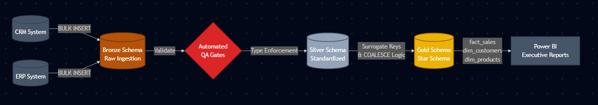
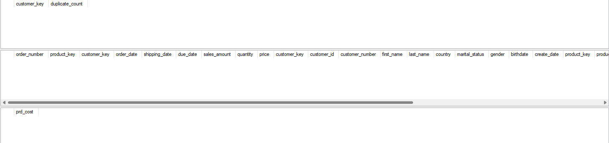
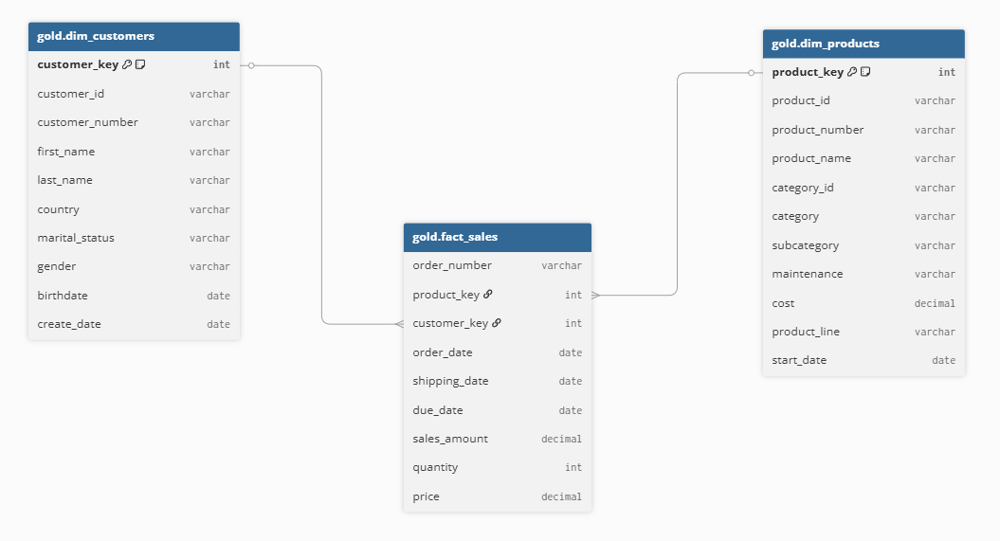

# Project 4.2: SQL Server Data Warehouse & Automated Quality Gates

## Business Context & Problem Statement
A retail business with separate CRM and ERP systems fundamentally cannot answer basic questions about its own performance. The CRM knows *who* bought the product, and the ERP knows *what* shipped and *where*—but because they exist in separate databases with incompatible schemas, generating a single profitability report takes days of manual spreadsheet merging.

This project builds the integration layer: a full SQL Server Data Warehouse that ingests raw CRM and ERP data, enforces strict data quality through automated QA testing, and delivers a clean, business-ready Star Schema optimized for Business Intelligence reporting.

## The Engineering Approach: Simulating Enterprise Chaos
To simulate a realistic enterprise environment, I engineered a custom Python `Faker.js` script to generate over 100,000 rows of synthetic retail transaction data. 

I deliberately designed the raw source schemas to include the exact types of structural inconsistencies that plague real-world data migrations: null foreign keys, mismatched date formats, missing financial metrics, and duplicate records. This allowed me to build a pipeline that actively catches and cleans errors, rather than assuming the data is perfect.

## The Medallion Architecture
I architected the database using distinct SQL schemas to logically separate data by its quality and operational purpose:

1. **Bronze (The Vault):** Raw data is ingested directly from the CRM and ERP source files using `BULK INSERT` stored procedures. This layer acts as an immutable historical ledger.
2. **Silver (The Staging & Cleaning Layer):** Data types are enforced, legacy text strings are standardized, and cross-system IDs are mapped. This layer serves as the heavily filtered foundation for downstream modeling.
3. **Gold (The Business Layer):** The cleaned data is modeled into a Kimball-style Star Schema (`fact_sales`, `dim_customers`, `dim_products`). This highly aggregated layer connects directly to Power BI for sub-second executive reporting.

## Automated Quality Gates (Data Testing)
A data warehouse is a liability if the business cannot trust the numbers. Before any data is allowed to reach the Gold reporting layer, it must pass through a suite of automated QA stored procedures:

* **Duplicate Key Detection:** Scans for and quarantines accidentally duplicated transaction IDs.
* **Referential Integrity Validation:** Ensures no "orphan records" exist (e.g., a sale tied to a Customer ID that does not exist in the CRM dimension).
* **Negative Value Flagging:** Blocks impossible financial metrics (e.g., a negative product price) from skewing the revenue dashboards.

## Strategic Business Impact
By deploying this Medallion-structured SQL Server environment, the organization completely eliminates "spreadsheet chaos." 

* **Sales Leadership** can track revenue continuously by product, region, and customer segment.
* **Finance** is guaranteed accurate profit margin reporting because the data has passed strict, automated financial validation checks.
* **Data Governance** has a full, transparent audit trail from the Bronze raw data straight through to the Gold reporting views.

## Technical Workflow
* **Database Engine:** Microsoft SQL Server (T-SQL)
* **Architecture Concept:** Medallion Data Architecture, Kimball Star Schema
* **Key SQL Objects:** `BULK INSERT`, Stored Procedures (`CREATE PROCEDURE`), Views, Constraints, Custom QA Scripts
* **Synthetic Data Generation:** Python, `Faker` library

### How to Run
1. Clone the repository and navigate to `04_data_modeling_and_storage/4_2_sql_server_data_warehouse/scripts/`.
2. Execute `01_db_setup.sql` in SSMS to establish the database and schemas.
3. Run the respective DDL and Load scripts in the `Bronze/`, `Silver/`, and `Gold/` folders in sequential order.
4. Execute the QA testing scripts in the `Tests/` folder to validate data integrity.

## Next Steps in the Pipeline
While a local SQL Server is excellent for establishing foundational architecture and strict data typing, modern, high-volume data teams require the elasticity and collaboration of the cloud. In **Project 4.3 (Snowflake & dbt Cloud Analytics)**, I migrate this exact architectural logic into a fully cloud-native, version-controlled warehouse environment.