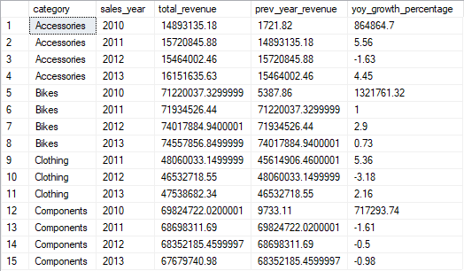
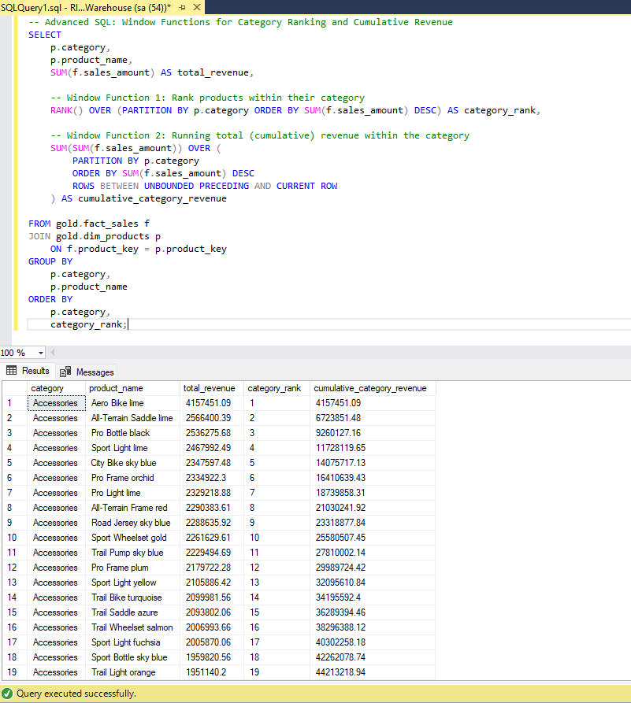

# Project 5.1: Advanced SQL Analytics & BI Reporting

## Business Context & Problem Statement
A data warehouse is only as valuable as the decisions it drives. In Stage 4, we successfully built and populated a secure SQL Server environment. However, raw tables do not answer business questions. 

This project represents the "last mile" of data analytics: writing advanced T-SQL queries to extract actionable intelligence for the executive team. Using the synthesized retail database, I developed a 13-script analytics suite designed to uncover hidden trends in product performance, customer retention, and regional profitability.

## Key Questions This Analysis Answers
Before writing any code, I aligned this analytics suite with the exact questions a Director of Sales would ask:
* Which specific product lines are driving our year-over-year revenue growth, and which are quietly losing market share?
* What is the lifetime value (LTV) and repeat-purchase rate of our top customer segments?
* How does seasonal demand impact our supply chain, and when do our highest-margin months occur?
* Which geographic regions are underperforming their historical baselines?

## The Analytical Approach: Hypothesis Testing
Rather than just pulling generic aggregations, I approached the data with specific business hypotheses to test. 

**The Hypothesis:** The prevailing belief within the business was that our historical "Flagship" product lines (Bikes and Components) were the primary drivers of current revenue growth and should receive the majority of the marketing budget.

**The Finding:** By utilizing SQL window functions with `LAG()` to calculate Year-over-Year (YoY) variance, the data completely disproved the hypothesis. The high-volume Components category is actually in a steady, multi-year decline, posting negative growth for three consecutive years (-1.61%, -0.50%, -0.98%). Furthermore, the flagship Bikes category—despite its massive $74M revenue footprint—has stagnated, dropping to a sub-1% growth rate (0.73%). The true momentum is being driven by secondary categories like Accessories, which bounced back with a massive +4.45% growth in the most recent year.

## Technical Workflow & SQL Techniques
To generate these insights, I utilized advanced T-SQL capabilities to manipulate the Star Schema:
* **Window Functions:** Leveraged `ROW_NUMBER()`, `RANK()`, and `LAG() OVER(PARTITION BY...)` for running totals, category rankings, and year-over-year variance calculations.
* **Common Table Expressions (CTEs):** Used heavily to break down complex, multi-step calculations (like calculating yearly baseline averages before calculating variance) into readable, modular code.
* **Dynamic Aggregation:** Grouping sets and pivot logic to reshape raw transaction data into BI-ready matrix formats.

## Strategic Business Impact & Directives
Based on the SQL output, I formulated the following strategic directives for the leadership team:
1. **Reallocate Marketing Spend:** Immediately shift a portion of the ad budget away from the declining Components category and into the emerging Accessories and Clothing lines to capture market momentum.
2. **Defensive Retention for Bikes:** Deploy automated retention campaigns specifically targeting previous Bike purchasers to protect our most valuable baseline revenue from sliding into negative growth next year.
3. **Regional Intervention:** Investigate the specific sales territories that showed a negative year-over-year variance in Q3 to identify potential supply chain or personnel issues.
4. **Data Gap Identification (Next Steps):** To make Directive #1 even more confident, we need to ingest web-traffic data (Google Analytics) into the warehouse. Currently, we can see that Components sales are dropping, but without page-view data, we cannot tell if it is a traffic problem (fewer visitors) or a conversion problem (visitors are leaving without buying).

### How to Run
1. Clone the repository and navigate to `05_sql_analysis_and_optimization/5_1_advanced_sql_analytics/scripts/`.
2. Connect to the `DataWarehouse` database.
3. Execute the scripts sequentially from `01` to `13` to view the progression from initial data profiling to complex KPI generation.