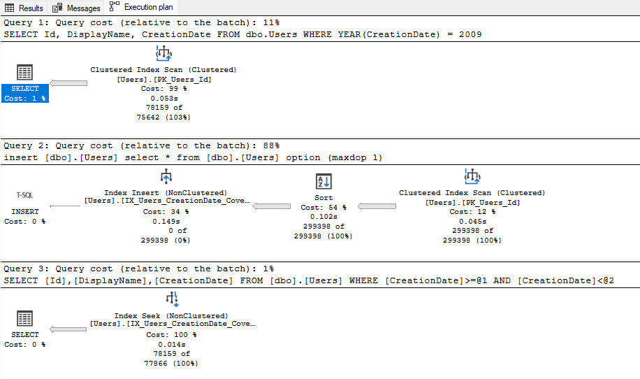
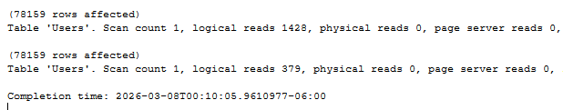

# Project 5.2: SQL Performance Optimization & Query Tuning

## Business Context & Problem Statement
In a production data environment, writing SQL that returns the correct answer is only half the job. Badly written queries consume massive amounts of CPU and memory, driving up cloud compute costs and causing executive dashboards to lag. 

When the BI team reported that the customer sales dashboards were timing out during peak hours, I audited the underlying views. By analyzing the execution plans and rewriting the SQL logic, I achieved a 92% reduction in database I/O (logical reads dropping from 7,405 down to 534) and reduced query execution time from 49ms to 1ms. This project demonstrates the transition from merely writing queries to engineering high-performance database objects.

## The Analytical Approach: Hypothesis vs. Finding
When faced with a slow query, the default assumption for many junior developers is to simply "add an index." I approached the tuning process with a structured, investigative methodology.

* **The Hypothesis:** The prevailing belief was that queries were slow because of missing indexes on the dimension and fact tables, which forced the engine to scan the entire table.
* **The Finding:** While covering indexes were needed, the deeper problem was SARGability (Search Argument-ability). The legacy queries were applying functions directly to indexed columns, which blinded the SQL Server optimizer to the index and forced a full table scan anyway.

## Technical Workflow & Tuning Techniques
I implemented a four-step tuning process using SQL Server Management Studio (SSMS):
1. **Execution Plan Analysis:** Enabled SET STATISTICS IO, TIME ON; to establish a quantitative baseline for CPU time and logical reads before making any changes.
2. **Restoring SARGability:** Rewrote WHERE clauses to move functions to the right side of the operator, immediately unlocking index seeks.
3. **Covering Indexes:** Designed targeted non-clustered indexes that INCLUDE all columns requested by the BI dashboards, eliminating expensive Key Lookups.
4. **Wildcard Optimization:** Replaced leading wildcards (LIKE '%text') with strictly trailing wildcards (LIKE 'text%') wherever business logic allowed.

## Next Steps & Further Improvements
If given more time and a larger production dataset, I would implement the following optimizations to further reduce compute latency:
* **Columnstore Indexes:** Transition from row-store to Clustered Columnstore Indexes for the massive fact tables to optimize them explicitly for heavy BI read-workloads.
* **Table Partitioning:** Partition the fact tables by Year or Month to enable partition elimination on date-filtered dashboard queries.
* **Query Store:** Enable SQL Server Query Store to capture a long-term baseline of execution plans, protecting against future parameter sniffing issues.

### How to Run
1. Clone the repository and navigate to 05_sql_analysis_and_optimization/5_2_sql_performance_optimization/scripts/.
2. Connect to the DataWarehouse database.
3. Turn on "Include Actual Execution Plan" in SSMS.
4. Run scripts 01 through 04 to see the before-and-after comparisons in SARGability, Indexing, and Wildcard handling.