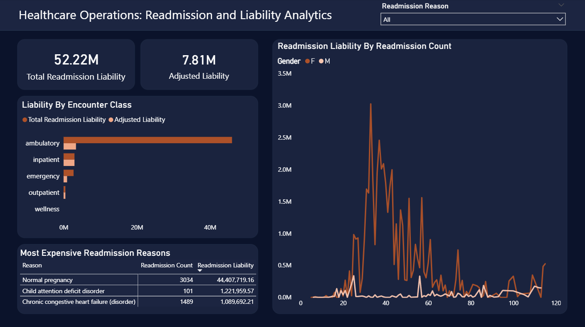

# Project 6.1: Healthcare Operations & Capacity Analytics

## The Setup: An Expensive Assumption
When a hospital gets hit with heavy Medicare penalties for 30-day patient readmissions, the immediate reaction is usually to blame the Emergency Department. 

That was the working hypothesis when I started this project. Leadership believed the ED was failing to treat patients effectively, causing them to bounce right back into the hospital and creating massive capacity bottlenecks. My job was to dig into the encounter data, track the readmission velocity, and figure out how to stop the financial bleeding. 

But once I got the data into SQL, the numbers told a completely different story. 

## The Investigation: What the Data Actually Said
I built a containerized SQL Server database to ingest the raw patient records and wrote some custom Window Functions to track how quickly patients were returning. I expected to see the ER glowing red with liability. Instead, here is what I found:

* **The ER wasn't the problem.** It accounted for just $5.7M in readmission liability—nearly at the bottom of the list.
* **Ambulatory Care was hemorrhaging money.** Routine, scheduled outpatient visits were driving a staggering $81.4M in readmission liability.
* **Urgent Care was a trap.** It had a smaller financial footprint ($14.4M), but a catastrophic 92.5% readmission rate. Almost everyone who went to Urgent Care ended up back in the hospital within a month.

## The Plot Twist: Finding the "Maternity Noise"
I knew Ambulatory care was driving the highest costs, so I segmented the data by patient demographics to see exactly *who* was coming back. 

I expected to see frail, elderly patients. Instead, the biggest spike was young women aged 18 to 55, generating over $50M in liability. That didn't make sense for a readmission crisis.

When I drilled down into the specific diagnosis codes for this group, I found the true culprit: **$37M of the hospital's "liability" was driven purely by normal pregnancies.** Maternity care naturally requires multiple scheduled visits within a 30-day window—prenatal checks, the delivery itself, and postnatal follow-ups. The hospital’s readmission algorithm wasn't broken; it was just naive. It was penalizing the Ambulatory department for successful, routine maternity visits, artificially inflating the hospital's failure rate by nearly 50%.

## The Business Impact & Recommendations
Data is only useful if it drives action. Based on this analysis, I recommended three immediate changes to the executive team:

1. **Fix the Algorithm:** We need to instantly filter Obstetrics and Gynecology encounters out of the general readmission penalty tracking. If we don't, we are misallocating resources and stressing over fake failures.
2. **Audit Urgent Care:** A 92% failure rate means Urgent Care isn't solving problems; it’s just delaying them. We need a clinical review of their discharge protocols immediately.
3. **Target the Real Risks:** Once I filtered out the "maternity noise," the true acute readmission risks for younger demographics surfaced: Acute Bronchitis and Appendicitis complications. That is exactly where we should be directing our post-discharge nursing follow-ups.

## Under the Hood: How I Built This
* **The Infrastructure:** I spun up a Microsoft SQL Server 2022 instance using Docker to mimic a real enterprise environment.
* **The Engineering:** I imported the flat files via SSMS and wrote the DDL scripts to build out the schema. 
* **The Analytics:** I used T-SQL (specifically CTEs and `LAG` Window Functions) to dynamically calculate the days between patient visits and flag true 30-day readmissions.
* **The Visualization:** I connected Power BI to the database using Import Mode to leverage the VertiPaq engine for speed. Finally, a custom template was built using SVG to make the dashboard intuitive and focused on the narrative.

### Visual Assets
To ensure the dashboard was visually clean and narrative-driven, I bypassed standard Power BI visuals. A custom template was built using SVG to provide a structured layout.

