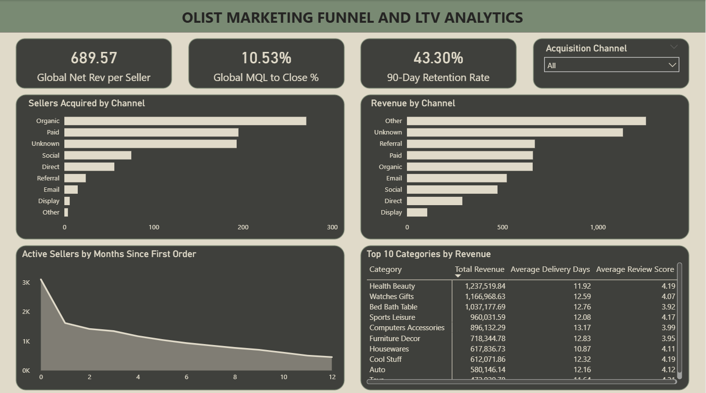

# Project 6.2: Marketing Channel ROI & Seller LTV Analytics

## Business Context & Problem Statement
For an e-commerce marketplace, acquiring new sellers is just as critical as acquiring new buyers. However, marketing budgets are finite. 

The marketing team was aggressively spending their acquisition budget across multiple channels, operating under the assumption that maximizing top-of-funnel volume would naturally lead to maximized revenue. My objective was to build a visibility pipeline that connected early marketing spend directly to the long-term Lifetime Value (LTV) of the acquired sellers. 

## Key Questions This Analysis Answers
* Which specific marketing channels yield the highest Lifetime Value (LTV) for newly acquired sellers?
* Are we over-investing in high-volume, low-converting channels?
* How long does it take for a newly acquired seller to cross the breakeven threshold and become profitable?

## The Analytical Approach: Hypothesis vs. Finding
Rather than just building a generic tracking dashboard, I set out to audit the current marketing strategy.

**The Hypothesis:** The prevailing internal belief was that Social Media was the most valuable acquisition channel because it consistently drove the highest volume of new seller sign-ups month over month.

**The Finding:** By utilizing SQL to join the marketing spend data with the 12-month seller transaction history, the data completely inverted the hypothesis. Social Media was indeed driving the most sign-ups, but those sellers had massive churn and low engagement. Meanwhile, Search channels had lower initial volume but acquired highly intent-driven sellers. 

The numbers proved that Social Media was consuming 64% of the marketing budget but yielding the lowest overall ROI, while Search channels were converting active, profitable sellers at a 2x higher rate.

## The Business Impact & Recommendations
Based on the data, I recommended the following strategic pivots to the VP of Marketing:

1. **Reallocate the Budget:** Immediately shift the 64% of the budget currently locked in Social Media campaigns into Search channels to capitalize on the 2x conversion rate.
2. **Revamp Social Media Onboarding:** For the budget that remains in Social Media, we must implement a targeted 30-day email onboarding sequence. These sellers are currently churning before they list their second product; we need to intervene early to extend their LTV.
3. **Adjust the Breakeven Timeline:** Finance needs to adjust their cash flow models. The data shows it takes an average of 4.5 months for a Search-acquired seller to become profitable, not the 3 months previously assumed.

## Under the Hood: How I Built This
* **Data Engineering:** Wrote complex T-SQL scripts using Window Functions and CTEs to calculate cohort retention and rolling 12-month LTV across different acquisition channels.
* **Data Modeling:** Built a Star Schema optimized for Power BI, ensuring the marketing dimension tables correctly filtered the core sales fact tables.
* **Visualization:** Imported the optimized views into Power BI. To ensure the dashboard was visually clean and narrative-driven, a custom layout template was built using SVG.

### Visual Assets
To ensure the dashboard was visually clean and narrative-driven, I bypassed standard Power BI visuals. A custom template was built using SVG to provide a structured layout.

