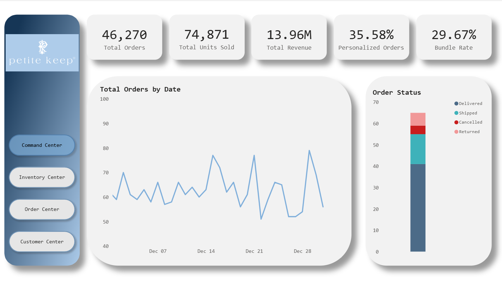
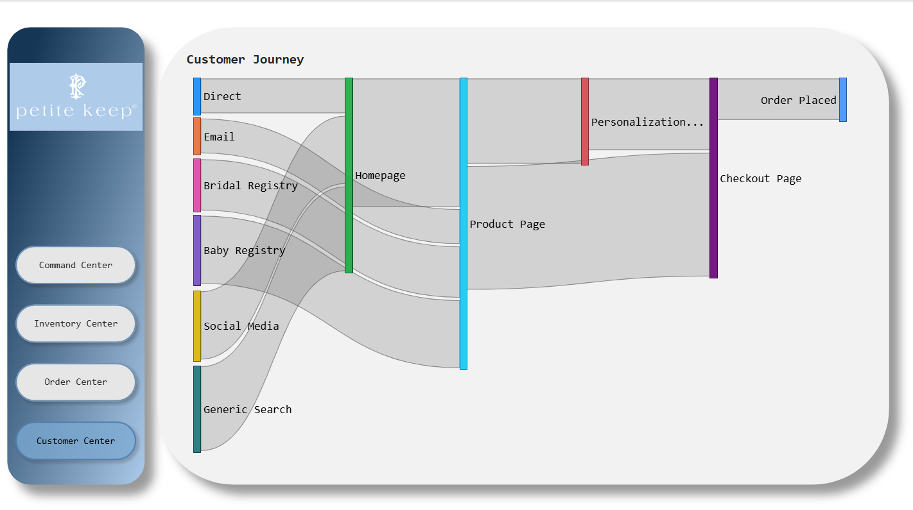
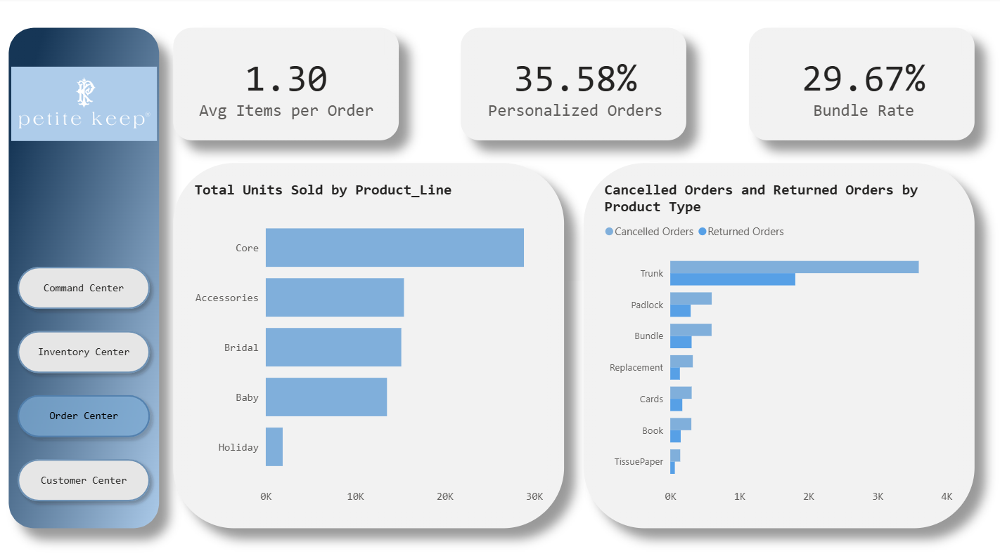
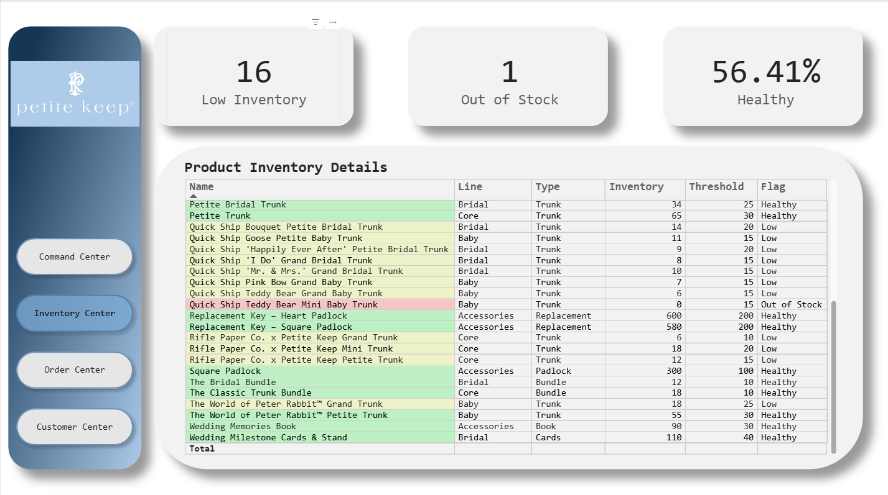

# Project 6.3: Executive Operations & E-Commerce Command Center

## Business Context & Problem Statement
As a luxury boutique e-commerce brand scales, operational complexity multiplies. High-margin personalized products require meticulous inventory management, while targeted customer acquisition requires a deep understanding of the funnel.

I engineered this multi-page Power BI application as a proactive proof-of-concept for an e-commerce brand (Petite Keep) to demonstrate how an Operations and Inventory Analyst can unify fragmented data streams. The objective was to eliminate the silos between marketing, inventory, and revenue reporting by building a single "Command Center" that allows executives to pivot instantly between high-level revenue health and granular supply chain logistics.

## Key Questions This Analytics App Answers
* What is the true margin driver of the business (base products vs. personalized bundles)?
* Which customer acquisition pathways yield the highest-intent buyers?
* Which specific product lines are driving operational liability through high return rates?
* How can procurement shift from reactive stockouts to proactive purchase orders?

## The Analytical Approach: Hypothesis vs. Finding
Instead of building a standard scrolling dashboard, I structured the application around operational pillars to test specific business assumptions.

* **The Hypothesis:** In luxury e-commerce, the prevailing assumption is often that the core "hero" products drive the vast majority of profitability and that generic search is the primary volume driver.
* **The Finding:** The data revealed a deeper nuance. While the brand generated $13.96M across 46,270 orders, the true margin drivers were the premium add-ons: 35.58% of all orders included personalization, and 29.67% were bundles. Furthermore, while generic search drove top-of-funnel volume, highly targeted pathways like "Bridal Registry" and "Baby Registry" fed directly into the highest-converting site pages.

Finally, the data uncovered a hidden liability: The hero products (Trunks) had an exponentially higher return and cancellation rate than any other product category, eating directly into those premium margins.

## The Business Impact & Recommendations
Based on the dashboard's automated insights, an Operations team could execute the following immediate actions:

1. **Audit Trunk Fulfillment (Operations):** The disproportionate return rate on Trunks triggers an immediate need to audit the shipping and QA process (e.g., transit damage) and review product detail pages for dimension clarity.
2. **Defend the Supply Chain (Procurement):** Utilizing the dynamic threshold matrix, procurement must issue immediate purchase orders for the 16 items flagged at critical inventory levels, specifically prioritizing the "Quick Ship Teddy Bear Mini Baby Trunk" which has hit zero stock.
3. **Fund Registry Partnerships (Marketing):** Reallocate top-of-funnel marketing spend to aggressively fund registry-partnership channels, as the customer journey mapping proves these are the highest-intent pathways to checkout.

## Under the Hood: Technical Architecture
* **UI/UX Engineering:** Designed a custom, app-like interface utilizing a custom SVG template and Power BI page navigation buttons to create a seamless left-hand navigation pane.
* **Advanced Visualizations:** Integrated a custom Sankey Diagram to map the complex, multi-stage customer acquisition funnel from traffic source to checkout.
* **DAX & Conditional Logic:** Engineered dynamic DAX measures to calculate Bundle Rates and Personalization Rates on the fly. Utilized conditional formatting in the Inventory matrix to trigger automated visual alerts based on specific threshold parameters for each product type.

### Visual Assets

**1. The Command Center (Macro Health)**

**2. The Customer Center (Acquisition & Funnel)**

**3. The Order Center (Product Economics & Liability)**

**4. The Inventory Center (Supply Chain Defense)**
