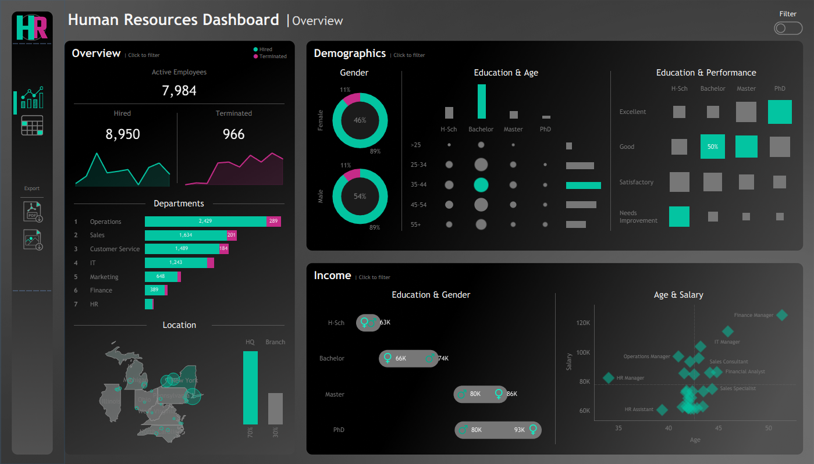
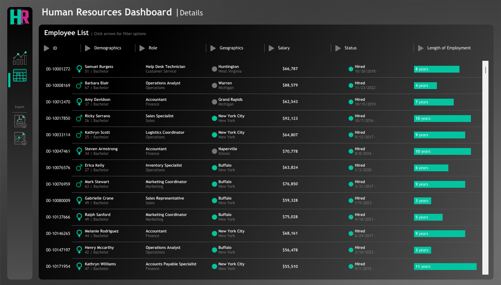

# Project 6.4: Human Resources Analytics & Predictive Attrition

## Business Context & Problem Statement
Employee turnover is one of the highest hidden costs in any enterprise. Replacing an employee often costs upwards of 1.5x their base salary in recruiting, onboarding, and lost productivity. Human Resources teams need to move beyond simple headcount reporting and start actively analyzing pay equity, performance distributions, and attrition risk.

The objective of this project was to build a comprehensive HR Command Center in Tableau that allows leadership to analyze an 8,950-employee workforce, pinpoint the root causes behind 966 historical terminations, and proactively audit organizational demographics.

## Key Questions This Analysis Answers
* Which specific departments and roles are driving the highest volume of costly employee turnover?
* Are there hidden pay equity gaps between genders or education levels within the same job titles?
* Does the organization have a localized retention crisis (e.g., a specific year or specific department)?
* How does employee tenure correlate with performance degradation?

## Data Sources
Instead of relying on a static, pre-cleaned Kaggle dataset, I engineered a custom Python pipeline to generate a highly realistic HR database. Utilizing `pandas`, `numpy`, and the `Faker` library, my `generate_data.py` script creates 8,950 unique employee records. The script uses weighted probability distributions to inject realistic business logic, including salary scaling multipliers based on education levels and historical termination spikes.

## The Analytical Approach: Hypothesis vs. Finding
Rather than just looking at the overall 10.7% historical churn rate, I used the dashboard to audit the underlying distribution of that turnover.

* **The Hypothesis:** Management assumed that the 966 historical terminations were evenly spread across the company and primarily driven by junior staff leaving for higher baseline salaries.
* **The Finding:** The data revealed a localized retention crisis. Turnover is not flat; there was a massive 20% spike in terminations during 2021 that disproportionately impacted the Operations department (the organization's largest cost center, currently holding 2,429 active employees). Furthermore, the Age vs. Salary scatter plots revealed isolated pay compression issues, highlighting pockets where compensation scaling did not perfectly align with education and tenure multipliers.

## Business Insights & Decision Implications
This dashboard shifts HR from a reactive administrative function to a proactive strategic partner. Based on the findings, I recommend the following actions:

1. **Targeted Retention Budgets:** Instead of across-the-board salary bumps, HR should allocate targeted retention bonuses and management training specifically to mid-tenure employees within the Operations department to stop the bleeding in our largest cost center.
2. **Proactive Compensation Audits:** The demographic income mapping allows the Legal and HR teams to proactively identify and correct any unintentional gender or age-based pay gaps before they become compliance liabilities.
3. **Performance Interventions:** Using the granular drill-down matrix, department heads must pull lists of high-tenure (10+ years) employees currently flagged with "Needs Improvement" performance ratings to trigger immediate management interventions or transition plans.

## Dashboard / Visualization Overview
The Tableau application is designed for top-down executive filtering:
1. **The Overview Page (Macro Organizational Health):** Tracks overall headcount, department footprints, and features a dual-axis pay equity scatter plot mapping Age vs. Salary to instantly audit compensation fairness.
2. **The Details Page (Granular Employee Auditing):** Built as a drill-down matrix allowing HR managers to filter by specific demographics, roles, or performance ratings.

### Visual Assets

## Technical Workflow
* **Data Engineering:** Python (`pandas`, `numpy`, `datetime`, `Faker`).
* **Visualization Tool:** Tableau Desktop.
* **Techniques Used:** Synthetic data generation, custom calculated fields, interactive tooltips, and dashboard action filters.

### How to Run
1. Run `python scripts/generate_data.py` to generate the fresh synthetic employee dataset.
2. Open the Tableau `.twb` file and ensure it is connected to the generated output data.

## Next Steps & Further Improvements
If I were to deploy this in a live enterprise environment, my next step would be to integrate unstructured exit interview data. By running NLP sentiment analysis over the exit survey text, we could determine exactly *why* the 2021 Operations spike occurred (e.g., compensation dissatisfaction vs. poor management) rather than simply observing that it happened.