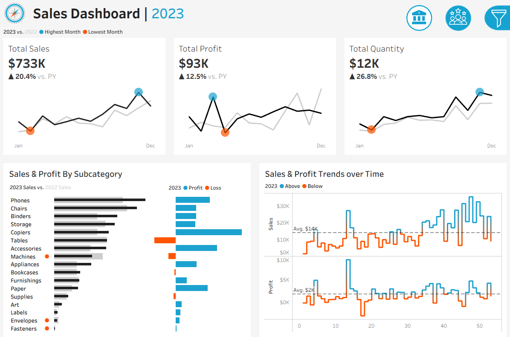
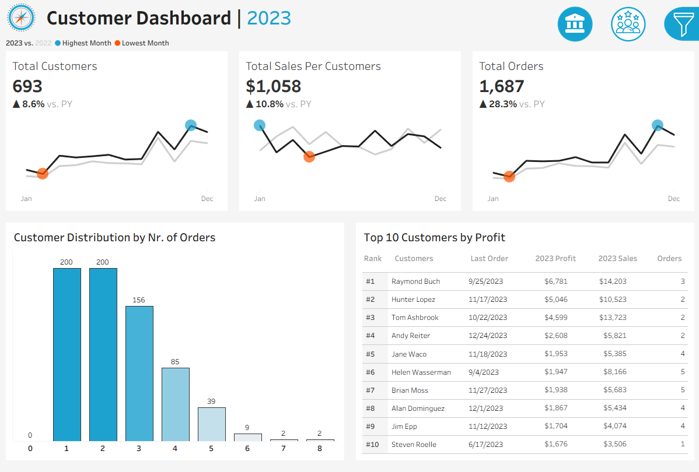
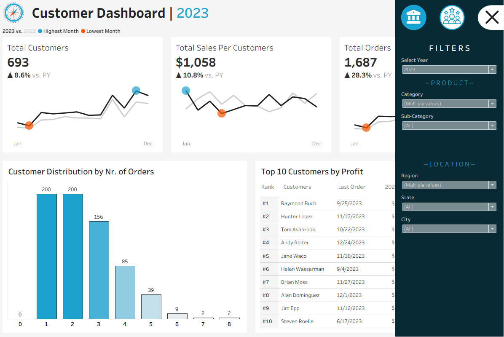

# Project 6.5: Sales & Customer Analytics Dashboard

## Business Context & Problem Statement
Retail organizations often track orders, customers, products, and locations in separate, siloed systems. This fragmentation makes it incredibly difficult to identify which customers actually drive the most profit, which products generate or destroy margins, and how overall sales performance is evolving. 

This project integrates these isolated domains into a single analytical environment. The objective was to build a unified Tableau Command Center that enables executives to move instantly from high-level KPIs to granular, operational insights.

## Key Questions This Analysis Answers
* What percentage of the customer base is driving the majority of the net margin?
* How is sales volume growth correlating with actual profitability?
* Which specific product categories are acting as loss-generating liabilities?
* What are the purchasing patterns of our highest Lifetime Value (CLV) customers?

## Data Sources
The foundational data consists of raw CSV files (`Orders`, `Customers`, `Products`, and `Location`) that were fragmented across EU and non-EU regional splits. These required ingestion and schema harmonization to build a unified Star Schema analytical view.

## The Analytical Approach: Hypothesis vs. Finding
* **The Hypothesis:** The prevailing assumption was that aggressive unit volume growth naturally leads to proportional profit growth, and that all active customers contribute relatively evenly to the bottom line.
* **The Finding:** The data completely disproved this. While total sales hit $733K (+20.4% YoY) and unit volume increased by 26.8% (to 12K units), total profit only grew by 12.5% (to $93K). Sales volume is growing twice as fast as profitability, revealing severe margin pressure. Furthermore, the Pareto Principle is in full effect: while the overall customer base grew to 693 accounts, a highly concentrated top 20% of repeat buyers generates over 80% of the total revenue, with the absolute top customers yielding $4K to $6K in profit each.

## Business Insights & Decision Implications
This dashboard shifts the organization's focus toward margin-protecting operations and high-yield acquisitions. It empowers leadership to take the following actions:

1. **Targeted Marketing Spend:** Shift acquisition and retention budgets away from generic campaigns and focus entirely on acquiring lookalike audiences matching the high-value repeat customer profiles generating $4K+ in profit.
2. **Inventory & Pricing Optimization:** Force immediate pricing audits or inventory reductions on the high-revenue but loss-generating product categories (Tables and Machines) while doubling down on high-performing categories (Phones, Chairs, Binders, and Copiers).
3. **Margin Protection Strategy:** Investigate and restructure the specific discounting or promotional strategies that caused a 26% spike in unit volume but only a 12% increase in actual profit.

## Dashboard / Visualization Overview
The visualizations highlight stark contrasts in performance and profitability across the business, utilizing KPI scorecards, time-series trend analysis, and interactive dashboard cross-filtering.

### Visual Assets

## Technical Workflow
* **Tool:** Tableau Desktop
* **Data Modeling:** Engineered a relational Star Schema utilizing `Orders` as the central Fact Table, seamlessly joined to `Customers`, `Products`, and `Location` Dimension Tables.

## Next Steps & Further Improvements
If given access to live production CRM data, my immediate next step would be to build a Predictive Lifetime Value (LTV) model. By identifying the early purchasing signals of the $4K-$6K profit tier, we could flag high-potential new accounts within their first 30 days and fast-track them to premium account management.