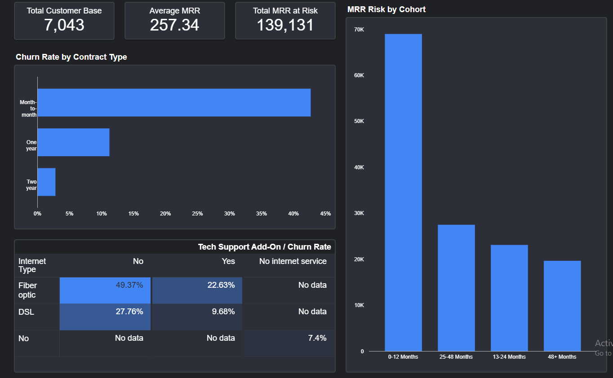

# Project 6.6: SaaS Churn & Revenue Risk Analysis

**[View the Live Interactive Dashboard Here](https://lookerstudio.google.com/s/vYfCFdggv7M)**

## Business Context & Problem Statement
In subscription-based SaaS and Telecom business models, top-line Monthly Recurring Revenue (MRR) growth can often mask underlying retention crises. If the sales team is acquiring new users faster than old users cancel, overall revenue appears to grow, blinding leadership to the fact that they are leaking cash at the bottom of the funnel (the "Leaky Bucket" illusion).

The objective of this project was to leverage cloud data warehousing to uncover the true root causes of customer churn and to quantify the exact dollar amount of Monthly Recurring Revenue (MRR) currently bleeding out of the business.

## Key Questions This Analysis Answers
* When do customers typically churn (early tenure vs. late tenure)?
* Which contract types hold the highest concentration of volatile, at-risk Monthly Recurring Revenue (MRR)?
* How do premium product add-ons (like Tech Support) impact the churn rate of core tier products like Fiber Optic internet?

## Data Sources
The analysis is built on a telecom subscriber dataset (`telecom_churn.csv`) containing customer demographics, subscription types, tenure duration, and monthly charges. This raw data was ingested into Google BigQuery to serve as the analytical data warehouse.

## The Analytical Approach: Hypothesis vs. Finding
I engineered advanced SQL views in BigQuery to calculate cohort decay, MRR at risk, and product-churn correlations, connecting the output to Looker Studio.

* **The Hypothesis:** Going into this project, the prevailing business hypothesis from executive leadership was that customer churn was primarily a *pricing* issue. 
* **The Finding:** The data completely disproved the pricing hypothesis and revealed that churn is actually an *onboarding and product-fit* problem. 
    1. **The "Month 0-12" Death Cliff:** The overwhelming majority of churned MRR occurs in the first 12 months, proving a failure to successfully onboard and activate users.
    2. **The Contract Moat:** Customers on Month-to-Month contracts churn at a staggering rate of over 42%, while converting a user to a 1-year or 2-year contract drops the churn rate to under 10%. 
    3. **The "Fiber" Product-Fit Failure:** Users on the expensive "Fiber Optic" plan who *do not* have "Tech Support" add-ons churn at exponentially higher rates due to unsupported premium experiences.

## Business Insights & Decision Implications
This dashboard shifts the executive conversation from "acquire more users" to "plug the onboarding leak." I recommend three immediate interventions:

1. **Mandatory Onboarding for Fiber:** Any user purchasing Fiber Optic internet must be routed through a high-touch onboarding sequence or automatically bundled with Tech Support for the first 90 days to ensure product success.
2. **The Annual Conversion Play:** The dashboard quantifies exactly how much MRR is sitting on highly volatile month-to-month contracts. Marketing must deploy aggressive discount offers specifically targeting month-to-month users in Month 9 to lock them into annual contracts *before* they hit the 12-month churn cliff.
3. **Redefining the North Star Metric:** Shift the leadership KPI from "Net New Subscribers" to "Net MRR Retention" to ensure the business is optimizing for lifetime value, not just top-of-funnel acquisition.

## Dashboard / Visualization Overview
The analysis is delivered via a dynamic, dark-themed enterprise dashboard. Since live links can occasionally expire or face access restrictions, I have included static snapshots of the reporting suite below.

### Visual Assets

## Technical Workflow
* **Cloud Data Warehouse:** Google BigQuery
* **Data Engineering:** Engineered SQL views utilizing `COUNTIF`, `SAFE_CAST`, `SAFE_DIVIDE`, and `CASE` statements to dynamically bucket tenure cohorts, simulate MRR at risk, and aggregate cross-product true churn rates.
* **Visualization Tool:** Looker Studio
* **UI/UX:** Applied custom SaaS-themed styling (Constellation Dark Mode) and implemented chart-level calculated fields (e.g., `SUM(churned) / SUM(total_customers)`) to bypass default aggregation errors and ensure mathematically accurate percentage calculations across dimensional drill-downs.

### How to Run
1. Review the SQL logic in the `BigQuery SQL views` scripts within this repository.
2. Access the live interactive dashboard via the link at the top of this document.

## Next Steps & Further Improvements
With the descriptive analytics pipeline established, the next evolution of this project would be predictive machine learning. I would export the engineered features from BigQuery into a Python environment (`scikit-learn`) to train a Logistic Regression or Random Forest model. This would allow the business to assign a daily "Probability of Churn" score to every active customer, triggering automated retention workflows *before* the customer ever clicks the cancel button.
